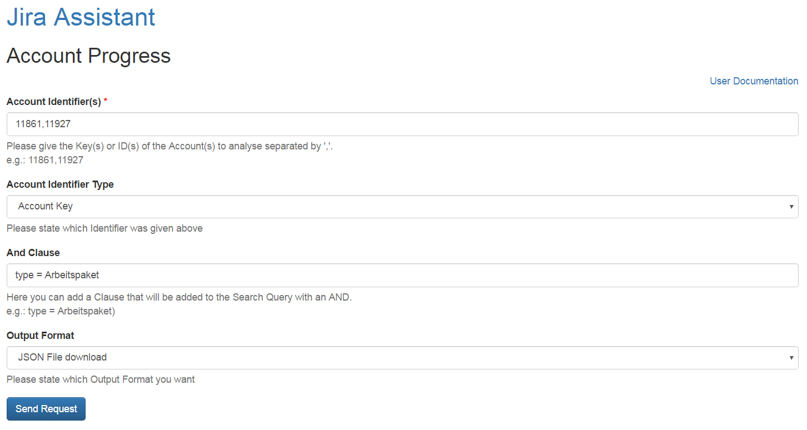

=====
Input
=====

Fields
======

Account identifier(s)
---------------------

This field identifies the account(s), you can give the key(s) or the ID(s) of
the account(s) you want to analyse. No spaces in between the account
identifiers and the ',' to separate them.

Account identifier type
-----------------------

In this dropdown you have to state which of the two possible identifiers you
stated in the previous field.

And clause
----------

Here you can add an AND clause to your analysis. This means it will be added to
the JQL query so it has to be valid JQL (JIRA Query Language) the clause will
be added with an AND, you must not enter the AND.

Output format
-------------

Here you can state the format you want the analysis result. Options are:

**Plain JSON**
  JSON will be put out directly into the browser window, plugins like JSONView
  are recommended.

**JSON file**
  You will get a download dialog to save the formatted JSON output to your
  hard-drive.
