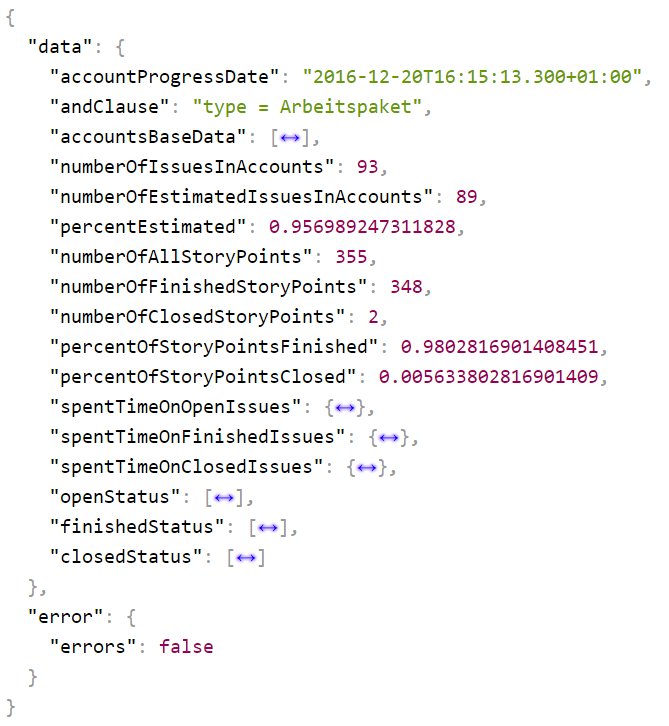
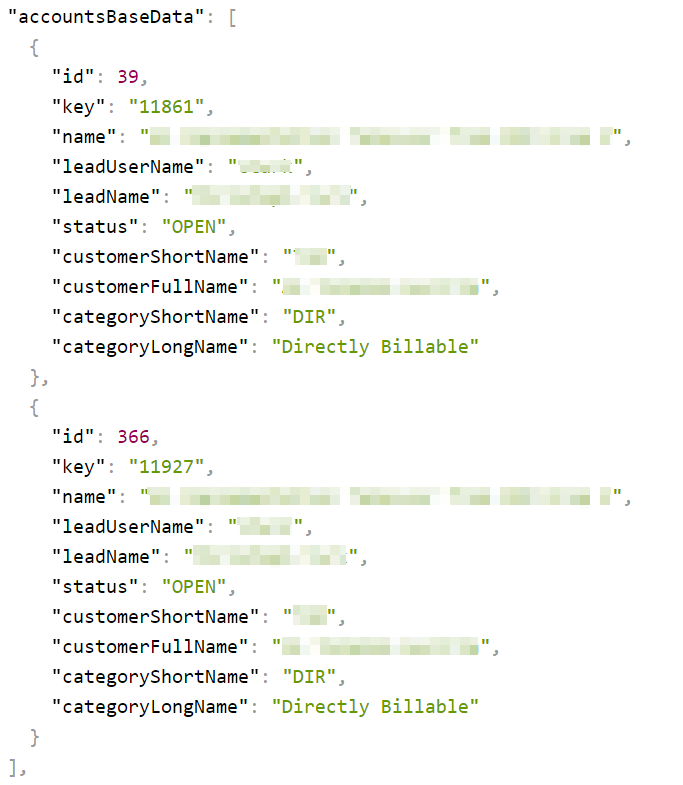

=======
Results
=======

Structure and base data
=======================

Values
------

**accountProgressDate**
  The date and time this analysis was executed

**andClause**
  The AND clause that was used to modify the analysis data

**numberOfIssuesInAccounts**
  Number of issues that were found in the given account(s) taking a possible
  AND clause into consideration

**numberOfEstimatedIssuesInAccounts**
  Number of issues that had an estimation, that was not emtpy or 0

**percentEstimated**
  The percentage of estimated issues in this analysis

**numberOfAllStoryPoints**
  Sum of the story points of the estimated issues

**numberOfFinishedStoryPoints**
  Sum of the story points of the issues that are finished at the time of the
  analysis

**numberOfClosedStoryPoints**
  Sum of the story points of the issues that are rejected or closed at the time
  of the analysis

**percentOfStoryPointsFinished**
  The percentage of the story points that are finished

**percentOfStoryPointsClosed**
  The percentage of the story points that are closed or rejected

Objects
-------

**accountsBaseData**
  A list of basic data of the account(s) in this analysis, for details see
  below with accountsBaseData_.

**spentTimeOnOpenIssues**
  The time booked on issues that were open at the time of the analysis

**spentTimeOnFinishedIssues**
  The time booked on issues that were finished at the time of the analysis

**spentTimeOnClosedIssues**
  The time booked on issues that were closed or rejected at the time of the analysis

**openStatus**
  Status that are neather recognised as finished nor as closed. This list is created while running the analysis and contains only the occuring status that were neather finished nor closed.

**finishedStatus**
  Status that were counted as finished (tested and deliverable)

**closedStatus**
  Status that were counted as closed (closed or rejected, for stories this means not deliverable)

Accounts base data
==================

.. _accountsBaseData:

Values
------

**id**
  The ID of the account

**key**
  The key of the account, in case of directly billable accounts this is also the number of the account in BMD

**name**
  The name of the account

**leadUserName**
  The user name of the lead of this account

**leadName**
  The full name of the lead of this account

**status**
  The status of this account

**customerShortName**
  The short name of the customer

**customerFullName**
  The full name of the customer

**categoryShortName**
  The short name of the account category

**categoryLongName**
  The long name of the account category
