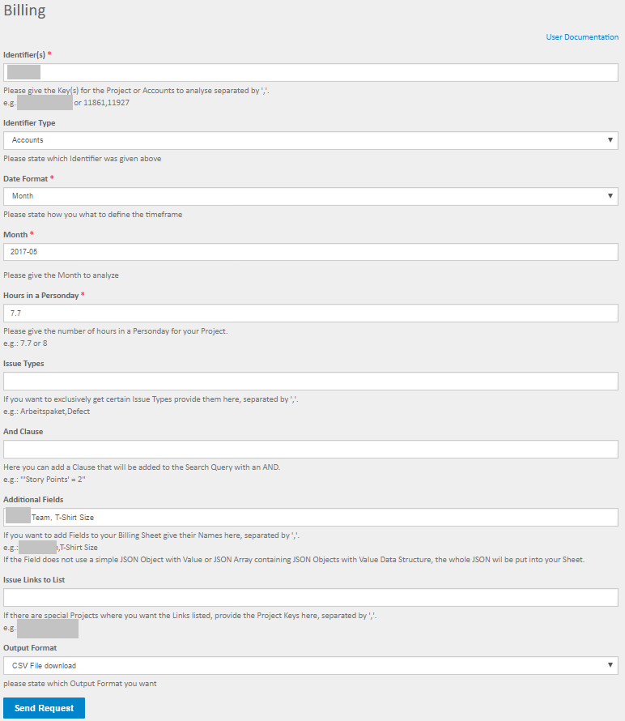
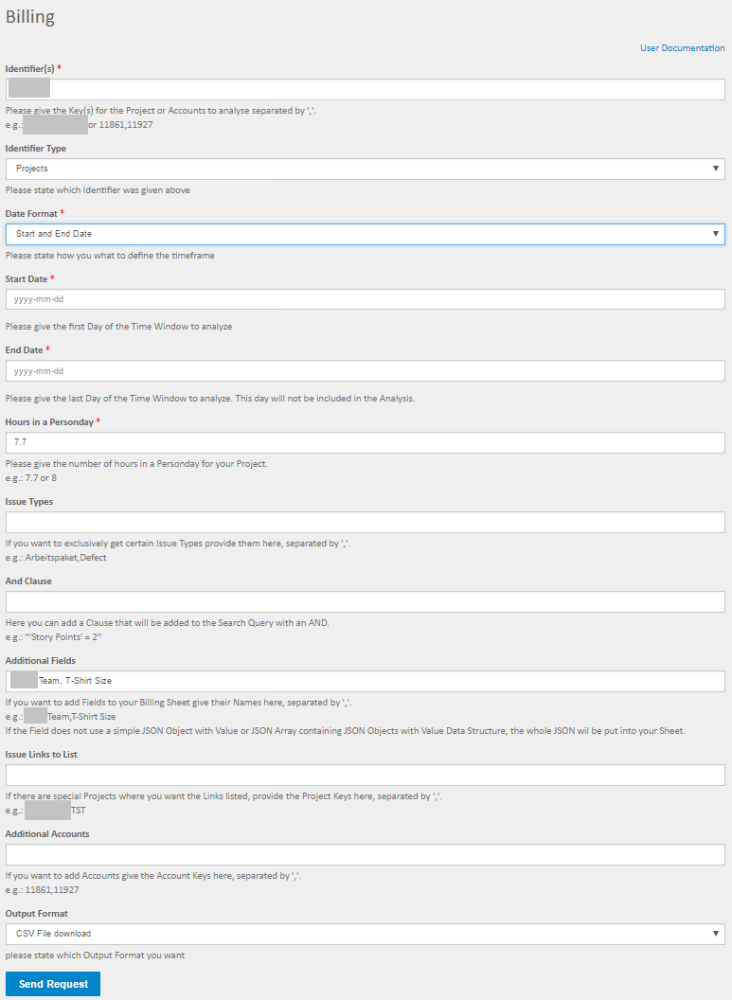
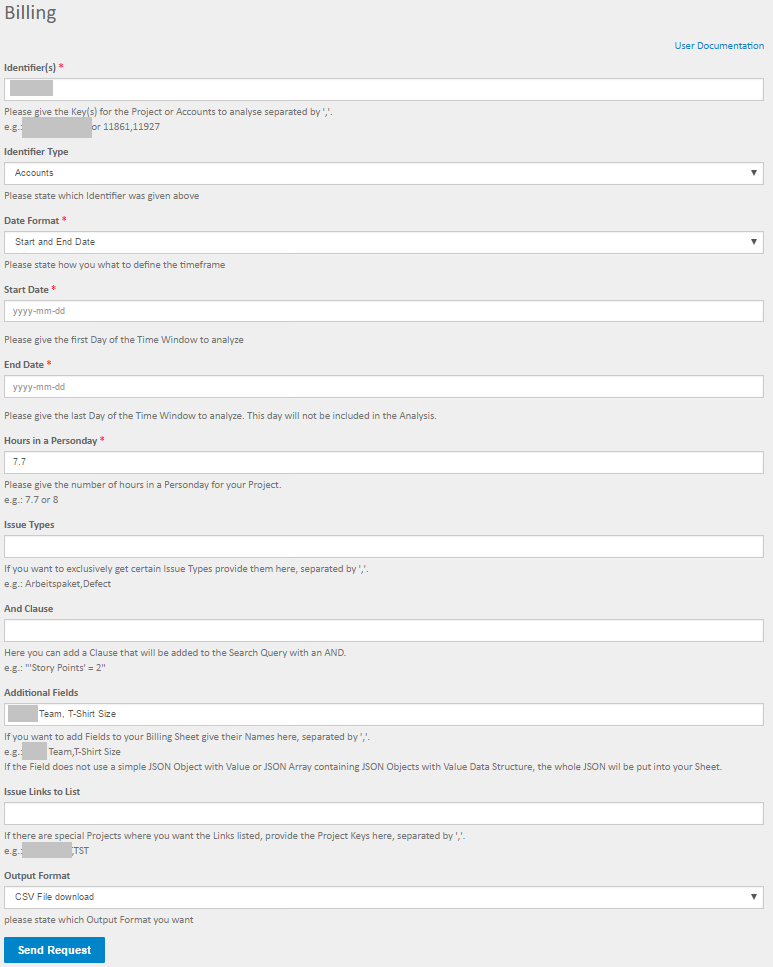

=====
Input
=====

Fields
======

Identifier(s)
-------------

Here you can define which projects or accounts you want to analyse. If you want
to analyse multiple projects or accounts just separate them with colons "," no
spaces.

Identifier type
---------------

Here you have to state if you chose projects or accounts as identifiers in the
field above.

Date format
-----------

You can choose between analyzing a month or a custom time-frame.

Month
-----

*This field is only shown if you choose "Month" as Date format*
You can state the month you want to analyze.

Start date
----------

*This field is only shown if you choose "Start and end date" as Date format*
The start date of the time-frame to analyze.

End date
--------

*This field is only shown if you choose "Start and end date" as Date format*
The end date of the time-frame to analyze. The end date day it self will not be
included in the analysis, since this feature always takes 00:00 as time for the
date.

Hours in a person-day
---------------------

Here you have to specify how many hours constitute one person-day in your
project. Common answers are "7.7" or "8.0".

Issue types
-----------

The issue types you want to analyse. If you want to analyze multiple issue
types just separate them with colons "," no spaces.  If you don't specify issue
types all issues will be taken into the analysis.

AND clause
----------

Here you can add an AND clause to your analysis. This means it will be added to
the JQL query, so it has to be valid JQL (JIRA Query Language) the clause will
be added with an AND you must not enter the AND.

Additional fields
-----------------

Here you can list field names that you want added to your billing sheet. If you
want multiple additional fields just separate them with colons "," no spaces.
If the field(s) do not use a simple JSON object with value or JSON array
containing JSON objects with value, data structure, the complete JSON from the
field will be put into your sheet. This does feature does not work for JIRA
native fields, e.g.: Assignee, Resolution ...

Issue links to list
-------------------

If you have a project that you regularly link issues to and you need those
links for billing you can list the projects those issues are in here. The keys
of the linked issues will be in the result.

Additional accounts
-------------------

*This field is only shown if you choose Projects as identifier type* If you are
creating the report by projects you can additionally provide account keys here
to also get issues in the report that are linked to those accounts.

Output format
-------------

Here you can state the format you want the analysis result. Options are:

**CSV file**
  You will get a download dialog to save the data as a CSV file to your
  harddrive.

**Plain JSON**
  JSON will be rendered directly into the browser window, plugins like JSONView
  are recommended.
