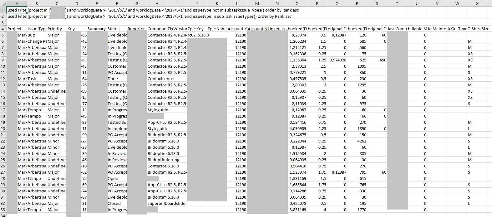
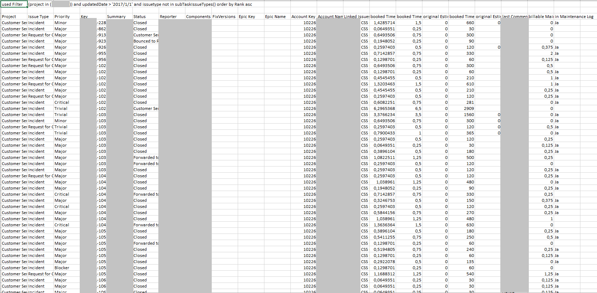
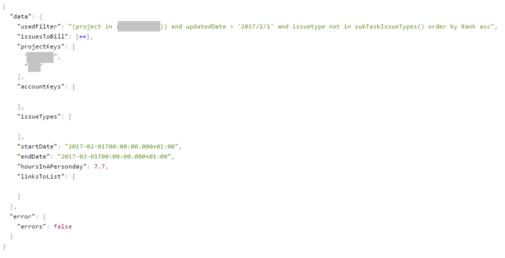
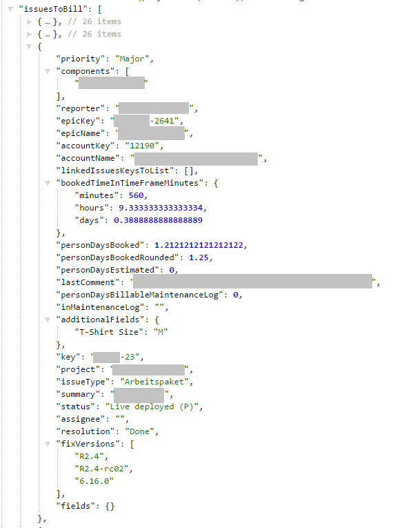
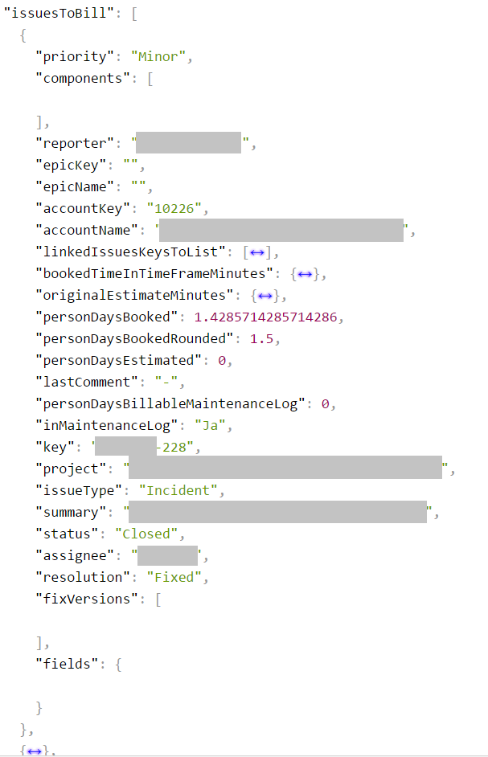

=======
Results
=======

CSV file output
===============

In the first line you will find the JQL query that was used to gather the data
for the report. Only issues with time booked during the given timeframe are
included in the report.

Columns
-------

.. _csvColumns:

**Project**
  The key of the project the issue in this line is in

**Issue Type**
  The type of the issues in this line

**Priority**
  The priority of the issues in this line

**Key**
  The issue key of the issue in this line

**Summary**
  The summary of the issue in this line

**Status**
  The status of the issue in this line

**Reporter**
  The reporter of the issue in this line (The one who created the issue)

**Components**
  The components the issue in this line is involved with

**FixVersions**
  The fix-versions the issue in this line is in

**Epic Key**
  The key of the epic the issue in this line belongs to

**Epic Name**
  The name of the epic the issue in this line belongs to

**Account Key**
  The key of the account the issue in this line is linked to

**Account Name**
  The name of the account the issue in this line is linked to

**Linked Issues**
  The issues keys of issues out of the given projects ('Issue Links to List' as
  defined in the input form) the issue in this line is linked to

**booked Time in PD**
  The booked time on the issue in this line during the given timeframe in
  person-days (Person-days are defined in the input form)

**booked Time in PD Rounded**
  The booked time on the issue in this line during the given timeframe in
  person-days, rounded up to the next quarter of a person-day (person-days are
  defined in the input form)

**original Estimate in PD**
  The original estimate from the issue in this line in person-days (Person-days
  are defined in the input form)

**booked Time in Minutes**
  The booked time on the issue in this line during the given timeframe in minutes

**original Estimate in Minutes**
  The original estimate from the issue in this line in minutes

**last Comment**
  The latest comment for the issue in this line, if there were comments

**billable Maintenance Log in Person Days**
  The amount of person-days entered in the maintenance log field for this issue

**in Maintenance Log**
  The value the field "in Maintenance Log" has for this issue

**Additional Fields**
  At the end of the row you can find the additional fields, if you added any.

JSON Output
===========

Structure and base data
-----------------------

Values
^^^^^^

**usedFilter**
  The filter used to gather the issues for the report

**startDate**
  The start of the timeframe for the report

**endDate**
  The end of the timeframe for the report

**hoursInAPersonDay**
  The number of hours in a person-day

Objects
^^^^^^^

**issuesToBill**
  A list of issues containing the information needed to bill them, see
  issuesToBill_ for details.

**projectKeys**
  The keys of the projects that were searched for issues to bill

**accountKeys**
  The keys of the accounts that were searched for issues to bill

**issueTypes**
  The issue types that were looked at for issues to bill, this list is empty if
  the report wasn't restricted to types.

**linksToList**
  The keys of the projects that were looked at for links to issues in the
  report.

Issues To bill
--------------

.. _issuesToBill:

Values
^^^^^^

Most of these values have been explained before already csvColumns_ or are
standard issue fields.

Objects
^^^^^^^

**linkedIssuesKeysToList**
  The issues keys of issues out of the given projects ('Issue Links to List' as defined in the input Form) the issue is linked to

**bookedTimeInTimeFrameMinutes**
  The booked time on the issue in this line during the given timeframe in minutes, hours and days. The days here are 24h days.

**originalEstimateMinutes**
  The original estimate from the issue in this Line in minutes, hours and days. The days here are 24h Days.

**components**
  The componentes the issue is concerning

**additionalFields**
  Here you get the values of the additional fields that were requested as a list, if there were values for those fields.

**fixVersions**
  The fix-versions the issue is in

**fields**
  Additional fields gathered for this issue. By default this list is empty.
