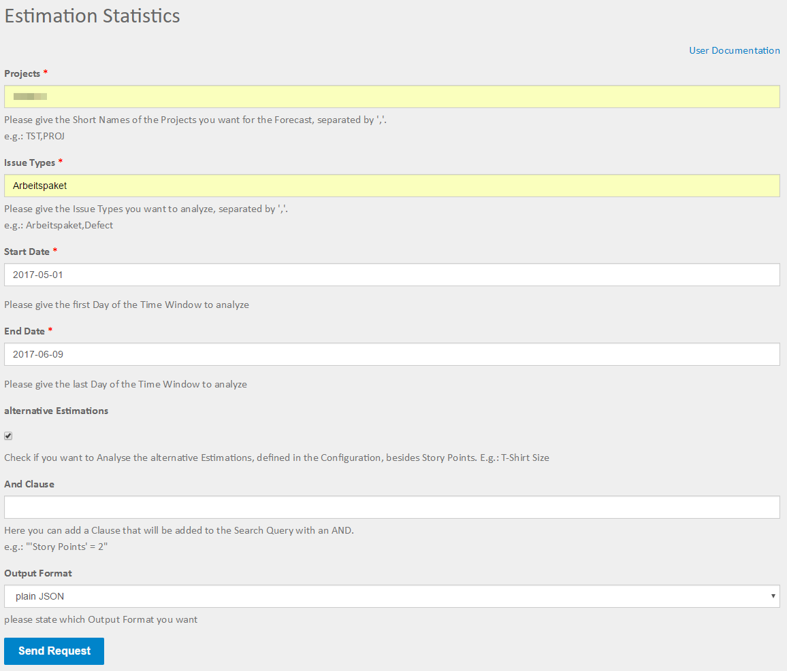

=====
Input
=====

Fields
======

Projects
--------

Here you define the project(s) that will be taken into account for the
statistics. If you want to use multiple projects just seperate them with colons
"," no spaces.

Issue types
-----------

The issue types you want to look at.

Start date
----------

The start of the time frame you want to analyse.

End date
--------

The end of the time frame you want to analyse.

Alternative estimations
-----------------------

If this is checked the analysis will not take story points as estimations, but
instead use the alternative defined in the configuration. e.g. T-Shirt Size

AND clause
----------

Here you can add an AND clause to your analysis. This means it will be added to
the JQL query, so it has to be valid JQL (JIRA Query Language) the clause will
be added with an AND you must not enter the AND.

Output format
-------------

Here you can state the format you want the forecast result. Options are:

**Plain JSON**
  JSON will be rendered directly into the browser window, plugins like JSONView
  are recommended

**Zipped CSV files download**
  You will get a download dialog for a ZIP file that contains multiple CSV
  files with the statistics information to your harddrive. There will be one
  CSV for every estimation value that were found (e.g.: 1SP, 2SP, 5SP, ...) and
  one CSV where all issues of a type are together.
