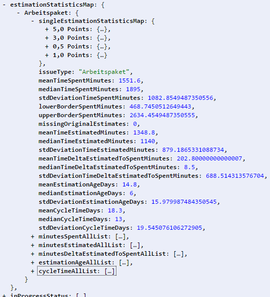

=======
Results
=======

Structure and base data
=======================

Values
------

**project**
  The project(s) this statistic was created for

**statisticsCreationDate**
  The date and time the statistics were calculated

**analysisStartDate**
  The start of the time frame that was analysed

**analysisEndDate**
  The end of the time frame that was analysed

Objects
-------

**estimationStatisticsMap**
  The statistics result data

**inProgressStatus**
  Status that were counted as "In Progress" (still beeing worked on)

**finishedStatus**
  Status that were counted as "Finished" (tested and deliverable)

Estimation statistics map
=========================

.. _estimationStatisticsMap:

This data structure has one entry per analysed issue type, in this case it was
only "Arbeitspaket".

Values
------

.. _estimationStatisticsMapValues:

**issueType**
  The issue type analysed in this statistics

**meanTimeSpentMinutes**
  The mean of the spent time on issues of this type

**medianTimeSpentMinutes**
  The median of the spent time on issues of this type

**stdDeviationTimeSpentMinutes**
  The standard deviation of the spent time on issues of this type

**lowerBorderSpentMinutes**
  The mean minus the standard deviation of the spent time on issues of this
  type

**upperBorderSpentMinutes**
  The mean plus the standard deviation of the spent time on issues of this type

**missingOriginalEstimates**
  Number of issues without an entry in the original estimate field

**meanTimeEstimatedMinutes**
  The mean of the estimated time (original estimate) on issues of this type

**medianTimeEstimatedMinutes**
  The median of the estimated time (original estimate) on issues of this type

**stdDeviationTimeEstimatedMinutes**
  The standard deviation of the estimated time (original estimate) on issues of
  this type

**meanTimeDeltaEstimatedToSpentMinutes**
  The mean of the difference in spent to estimated time (spent - estimated) on
  issues of this type

**medianTimeDeltaEstimatedToSpentMinutes**
  The median of the difference in spent to estimated time (spent - estimated)
  on issues of this type

**stdDeviationTimeDeltaEstimatedToSpentMinutes**
  The standard deviation of the difference in spent to estimated time (spent -
  estimated) on issues of this type

**meanEstimationAgeDays**
  The mean of the estimation age values (the time from the last estimation to
  In Progress) on issues of this type in days

**medianEstimationAgeDays**
  The median of the estimation age values (the time from the last estimation to
  In Progress) on issues of this type in days

**stdDeviationEstimationAgeDays**
  The standard deviation of the estimation age values (the time from the last
  estimation to In Progress) on issues of this type in days

**meanCycleTimeDays**
  The mean of the cycle time values (the time from In progress to Finished) on
  issues of this type in days

**medianCycleTimeDays**
  The median of the cycle time values (the time from In Progress to Finished)
  on issues of this type in days

**stdDeviationCycleTimeDays**
  The standard deviation of the cycle time values (the time from In Progress to
  Finished) on issues of this type in days

Objects
-------

.. _estimationStatisticsMapObjects:

**singleEstimationStatisticsMap**
  The map with the data based on the single estimation values that were found
  (e.g.: 1SP, 2SP, 5SP, ...)

**minutesSpentAllList**
  A list of all minutes spent values from the found the analysed issues, for
  graphical analysis or further calculations

**minutesEstimatedAllList**
  A list of all minutes estimated values from the found the analysed issues,
  for graphical analysis or further calculations

**minutesDeltaEstimatedToSpentAllList**
  A list of all minutes delta estimated to spent values from the found the
  analysed issues, for graphical analysis or further calculations

**estimationAgeAllList**
  A list of all estimation age values (the time from the last estimation to In
  Progress) from the found the analysed issues, for graphical analysis or
  further calculations

**cycleTimeAllList**
  A list of all cycle time values (the time from In Progress to Finished) from
  the found the analysed issues, for graphical analysis or further calculations

singleEstimationStatisticsMap
=============================

As seen above there is one entry for every occured estimation value during this
time frame. The basic data follows the same structure as above with the
estimation statistics map (estimationStatisticsMap_), except the data here is
only based on the current estimation. In the example above the data is
calculated for all 5 story point, Arbeitspaket issues during the time frame.

Values
------

**estimation**
  The estimation value this data is based on

**the rest**
  the rest of the values is the same as estimationStatisticsMapValues_

Objects
-------

**allIssues**
  A list of all issues of this type an this estimation finished during the time frame

**deviantIssues**
  A list of the issues of this type an this estimation finished during the time frame, that where outside the area of mean +- standard deviation, the outliers

**the rest**
  the rest of the values is the same as estimationStatisticsMapObjects_
