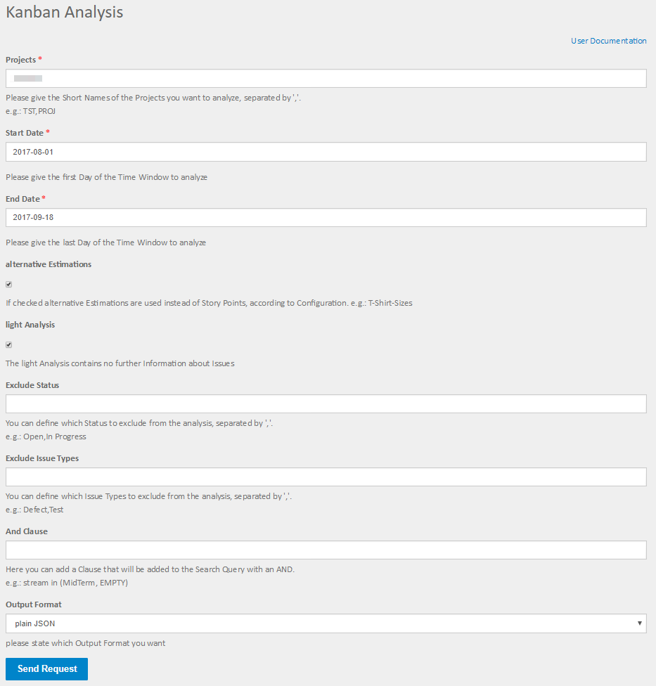

=====
Input
=====

Fields
======

Projects
--------

Here you can define which projects you want to analyse. If you want to analyse
multiple projects just separate them with colons "," no spaces.

Start date
----------

The start of the time frame you want to analyse.

End date
--------

The end of the time frame you want to analyse.

Alternative estimations
-----------------------

If you turn the alternative estimations on, the analysis will be made based on
an alternative estimation to story points. The field is defined in the
configuration, e.g.: T-Shirt Size.

Light analysis
--------------

If you turn light analysis off, you get a lot of additional information about
the issues in the sprint. It is recommended to keep it turned on.

Exclude status
--------------

Here you can exclude issues in certain status. If you want to exclude multiple
status just separate them with colons "," no spaces (only if they are part of
the status name).

Exclude issue types
-------------------

Here you can exclude issues of certain types.  If you want to exclude multiple
issue types just separate them with colons "," no spaces (only if they are part
of the issue type name).

AND clause
----------

Here you can add an AND clause to your backlog definition. This means it will
be added to the JQL query, so it has to be valid JQL (JIRA Query Language) the
clause will be added with an AND you must not enter the AND.

Output format
-------------

Here you can state the format you want the forecast result. Options are:

**Plain JSON**
  JSON will be rendered directly into the browser window, plugins like JSONView
  are recommended

**JSON File**
  You will get a download dialog to save the formatted JSON output to your harddrive
