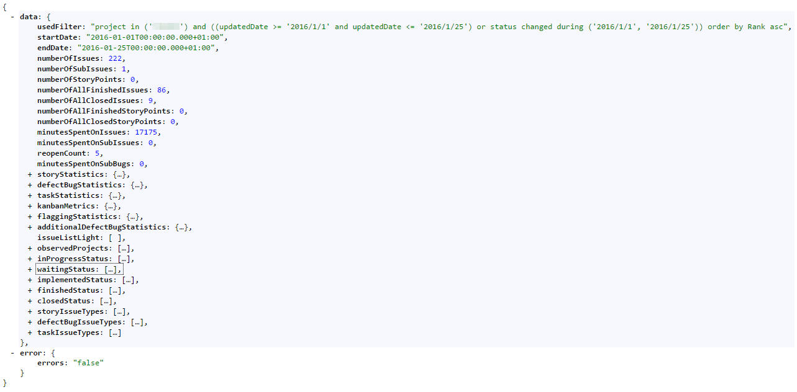
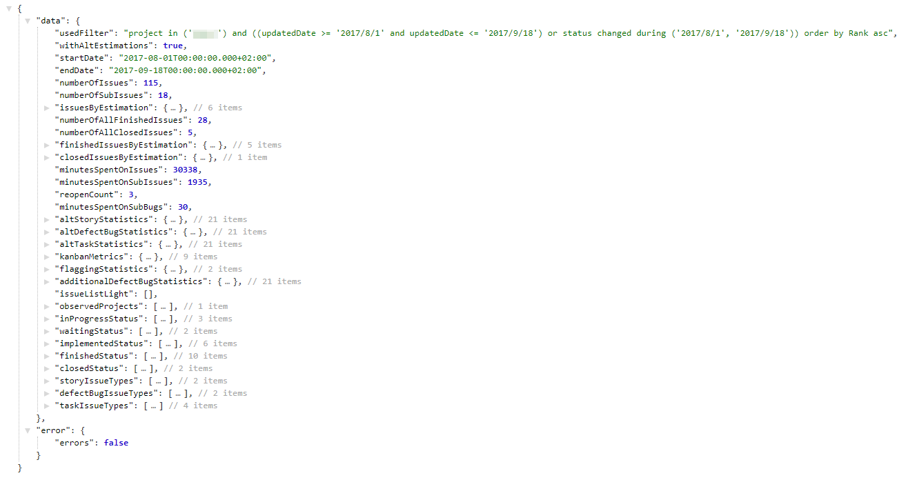
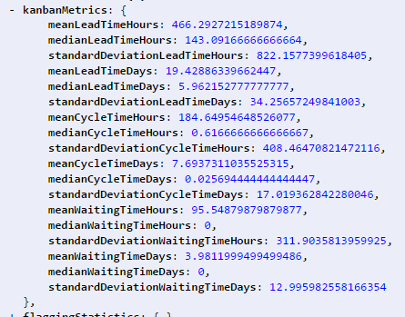
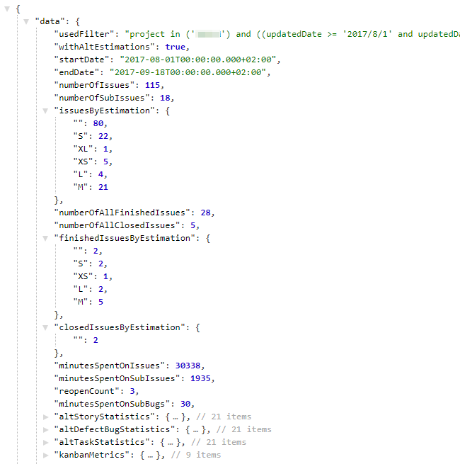

=======
Results
=======

Structure and base data
=======================

Values
------

**usedFilter**
  The JQL filter that was used as backlog for this analysis

**startDate**
  The start of the time frame that was analysed

**endDate**
  The end of the time frame that was analysed

**numberOfIssues**
  Number of all issues that were analysed, sub-issues are separate

**numberOfSubIssues**
  Number of all sub-issues that were analysed

**numberOfStoryPoints**
  Number of story points of all analysed issues

**numberOfAllFinishedIssues**
  Number of all issues finished (deliverable) during the analysed time frame

**numberOfAllClosedIssues**
  Number of all issues that were closed or rejected (for stories this means not
  deliverable) during the analysed time frame

**numberOfAllFinishedStoryPoints**
  Number of story points finished (deliverable) during the analysed time frame

**numberOfAllClosedStoryPoints**
  Number of story points that were closed or rejected (for stories this means
  not deliverable) during the analysed time frame

**reopenCount**
  Number of reopen actions during the analysed time frame. One issue that is
  reopened twice will count as two reopens

**minutesSpentOnSubBugs**
  Minutes booked on sub bug issues during the time frame (fixing reopend
  issues)

Objects
-------

**storyStatistics**
  Statistics about stories handled during the analysed time frame, for details
  please look `here
  <https://docs.local.netconomy.net/docs/tls/jira-assistant-sprintanalysis/master/docs/results.html>`_

**defectBugStatistics**
  Statistics about defects and bugs handled during the analysed time frame, for
  details please look `here
  <https://docs.local.netconomy.net/docs/tls/jira-assistant-sprintanalysis/master/docs/results.html>`_

**taskStatistics**
  Statistics about tasks (all issue types that are neither stories nor defects
  or bugs) handled during the analysed time frame, for details please look
  `here
  <https://docs.local.netconomy.net/docs/tls/jira-assistant-sprintanalysis/master/docs/results.html>`_

**kanbanMetrics**
  Special kanban metrics about the analyzed issues, for details see below
  kanbanMetrics_

**kanbanMetricsByEstimation**
  A map of kanban metrics (see below kanbanMetrics_) but separate for the
  estimation of the issues.

**flaggingStatistics**
  Statistics about flagged issues during this sprint, for details please look
  `here
  <https://docs.local.netconomy.net/docs/tls/jira-assistant-sprintanalysis/master/docs/results.html>`_

**additionalDefectBugStatistics**
  Additional infromation and statistics about defects and bugs during this
  sprint, for details please look `here
  <https://docs.local.netconomy.net/docs/tls/jira-assistant-sprintanalysis/master/docs/results.html>`_

**issueListLight**
  If you turned off the light analysis you will find the additional issue information in this List

**observedProjects**
  Projects that were taken into account for the additionalDefectBugStatistics

**inProgressStatus**
  Status that were counted as "In Progress" (still beeing worked on)

**waitingStatus**
  Status that were counted as "Waiting" (waiting for answer from somebody outside
  the team)

**implementedStatus**
  Status that were counted as "Implemented" (coded but untested)

**finishedStatus**
  Status that were counted as "Finished" (tested and deliverable)

**closedStatus**
  Status that were counted as "Closed" (closed or Rejected, for Stories this
  means not deliverable)

**storyIssueTypes**
  Issue types that were counted as stories

**defectBugIssueTypes**
  Issue Types that were counted as Defects and Bugs

**taskIssueTypes**
  Issue types that were counted as tasks (all issue Types that are neither
  stories nor defects or bugs)

Kanban Metrics
==============

.. _kanbanMetrics:

Values
------

**meanLeadTimeHours, meanLeadTimeDays**
  The mean of the lead times occurred in the analysed data, hours and days.
  Lead time is the time between creation of the issue and the time it went
  live.  This metric is in calendar days, so all days are counted including
  holidays and weekends and 24h = 1 day.

**medianLeadTimeHours, medianLeadTimeDays**
  The median of the lead times occurred in the analysed data, hours and days.
  Lead time is the time between creation of the issue and the time it went
  live.  This metric is in calendar days, so all days are counted including
  holidays and weekends and 24h = 1 day.

**standardDeviationLeadTimeHours, standardDeviationLeadTimeDays**
  The standard deviation of the lead times occurred in the analysed data, hours
  and days.  Lead time is the time between creation of the issue and the time
  it went live.  This metric is in calendar days, so all days are counted
  including holidays and weekends and 24h = 1 Day.

**meanCycleTimeHours, meanCycleTimeDays**
  The mean of the cycle times occurred in the analysed data, hours and days.
  Cycle time is the time between the first start of work on the issue and it's
  resolution.  This metric is in calendar days, so all days are counted
  including holidays and weekends and 24h = 1 day.

**medianCycleTimeHours, medianCycleTimeDays**
  The median of the cycle times occurred in the analysed data, hours and days.
  Cycle time is the time between the first start of work on the issue and it's
  resolution.  This metric is in calendar days, so all days are counted
  including holidays and weekends and 24h = 1 day.

**standardDeviationCycleTimeHours, standardDeviationCycleTimeDays**
  The standard deviation of the cycle times occurred in the analysed data in,
  hours and days.  Cycle time is the time between the first start of work on
  the issue and its resolution.  This metric is in calendar days, so all days
  are counted including holidays and weekends and 24h = 1 day.

**meanWaitingTimeHours, meanWaitingTimeDays**
  The mean of the waiting times occurred in the analysed data, hours and days.
  Waiting time is the time the issue was in a waiting status (see above for the
  list) from the creation of the issue to the end date of the analysis.  This
  metric is in calendar days, so all days are counted including holidays and
  weekends and 24h = 1 Day.

**medianWaitingTimeHours, medianWaitingTimeDays**
  The median of the waiting times occurred in the analysed data, hours and
  days.  Waiting time is the time the issue was in a waiting status (see above
  for the list) from the creation of the issue to the end date of the analysis.
  This metric is in calendar days, so all days are counted including holidays
  and weekends and 24h = 1 day.

**standardDeviationWaitingTimeHours, standardDeviationWaitingTimeDays**
  The standard deviation of the waiting times occurred in the analysed data,
  hours and days.  waiting time is the time the issue was in a waiting status
  (see above for the List) from the creation of the issue to the end date of
  the analysis.  This metric is in calendar days, so all days are counted
  including holidays and weekends and 24h = 1 day.

Alternative Estimations
=======================

When alternative estimations are used all the story point based estimation
metrics are replaced by metrics based on the alternative estimation field
defined in the configuration.

New objects
-----------

**issuesByEstimation**
  A list of all occurring estimations and the number of issues that had this
  estimation within the analysed issues.

**finishedIssuesByEstimation**
  A list of all the estimations and the number of issues with the estimation
  for the finished issues.

**closedIssuesByEstimation**
  A list of all the estimations and the number of issues with the estimation
  for the closed issues.
