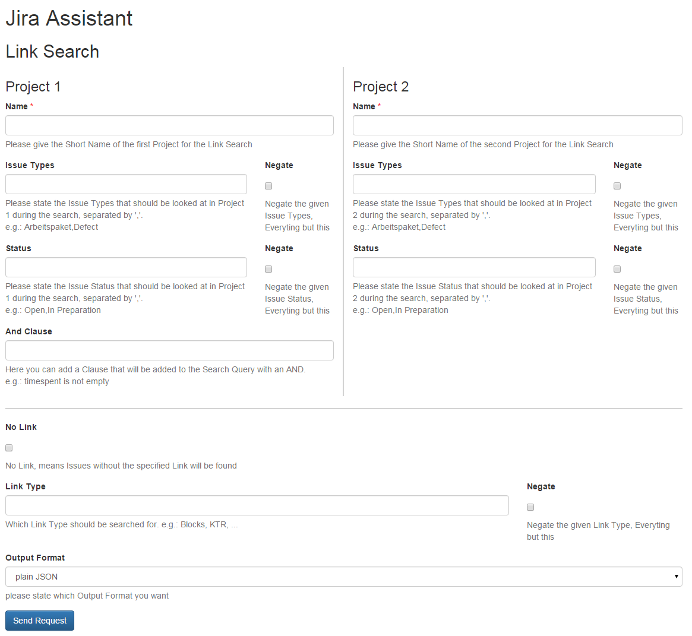
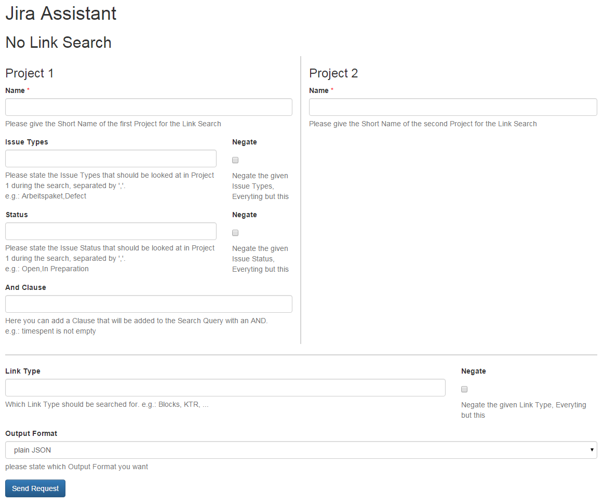

=====
Input
=====

Fields
======

You need to define the two projects you are looking at for links / no links.

.. warning::
  This functionality has to go through a lot of data and takes quite some
  time, so every restriction you can give to narrow done the data, will shorten
  the runtime drastically. The fields except for the name field are not
  mandatory but help to narrow down the data.

.. hint::
  To make this feature work faster use the project with less issues to your
  specifications as first project.

Name
----

The short name of the project, e.g.: NCA

Issue type
----------

The issue types you want to look at. You can negate the issue types by checking
the checkbox, so that all except the given issue Types will be taken into
account.

Status
------

The status you want to look at. You can negate the status by checking the
checkbox, so that all except the given status will be taken into account.

AND clause
----------

You can additionally narrow down the search by providing an AND clause for the
first project. This means it will be added to the JQL query for the issues of
the first project, so it has to be valid JQL (JIRA Query Language) the clause
will be added with an AND you must not enter the AND.

No link
-------

Here you can state if you want to look for issues without the specified link.
For the no-link search this is automatically true. The no-link search only
looks at the project of the linked issue to determine if a link matches.

Link type
---------

Here you can give a specific link type you are looking for. You need to know
the right link name in JIRA e.g.: Blocks, ...

Output format
-------------

Here you can state the format you want the forecast result. Options are:

**Plain JSON**
  JSON will be rendered directly into the browser window, plugins like JSONView
  are recommended
**CSV file download**
  You will get a download dialog to save a CSV file with the link information
  to your harddrive
