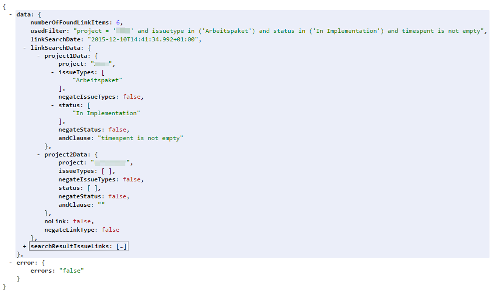
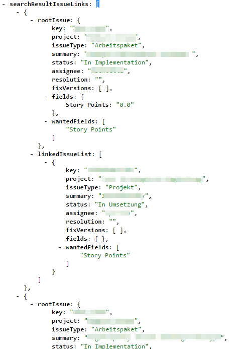

=======
Results
=======

Structure and base data
=======================

Values
------

**numberOfFoundLinkItems**
  The number of links that fitted the specified restrictions

**usedFilter**
  The JQL filter that was built to look for Issues in the first project to be
  used as basis for the search

**linkSearchDate**
  The date and time the search was executed

Objects
-------

**linkSearchData**
  The specified search data that was used to look for links

**searchResultIssueLinks**
  The search results, see below for details

Search Result Issue Links
=========================

Values
------

**rootIssue**
  The issue from the first project that is the basis for the link, or no link
  in case of no-link search

**linkedIssueList**
  A list of issues this root issue was linked to in the specified way. This is
  empty in case of no link search obviously.
