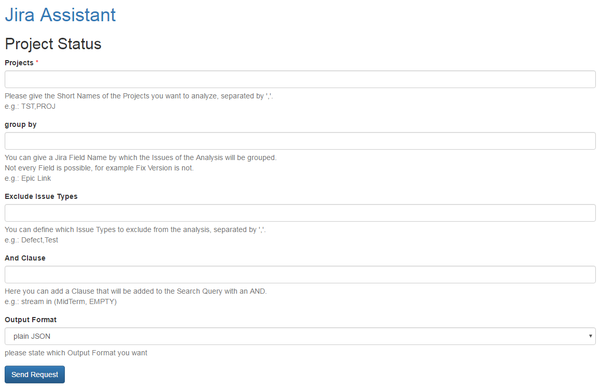

=====
Input
=====

Fields
======

Projects
--------

Here you can define which projects you want to analyse. If you want to analyse
multiple projects just separate them with colons "," no spaces.

Group by
--------

Here you can give a field, the analysed issues will be grouped by. For example
'Epic Link', which means the issues will be analysed by their epics. This
functionality only works for custom fields and only for fields with single
values.

Exclude issue types
-------------------

Here you can exclude issues of certain types.  If you want to exclude multiple
issue types just separate them with colons "," no spaces (only if they are part
of the issue type name).

AND clause
----------

Here you can add an AND clause to your analysis. This means it will be added to
the JQL query, so it has to be valid JQL (JIRA Query Language) the clause will
be added with an AND you must not enter the AND.

Output format
-------------

Here you can state the format you want the forecast result. Options are:

**Plain JSON**
  JSON will be rendered directly into the browser window, plugins like JSONView
  are recommended

**CSV file download**
  You will get a download dialog to save a CSV file with the forecast to your
  harddrive
