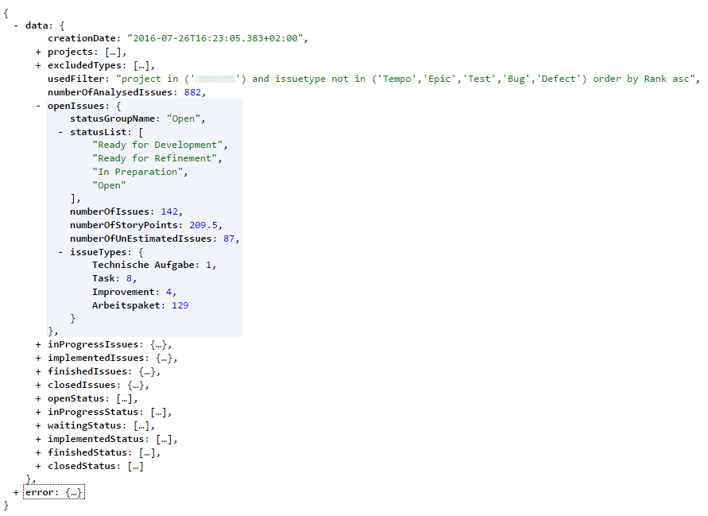
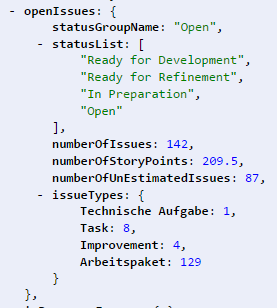
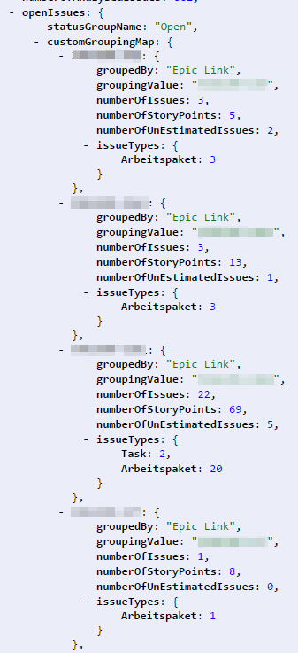

=======
Results
=======

Structure and base data
=======================

Values
------

**creationDate**
  The date and time this analysis was created

**usedFilter**
  The JQL filter that was used as base for this analysis

**numberOfAnalysedIssues**
  The number of issues that were analysed in total

Objects
-------

**projects**
  The projects that were analysed

**excludedTypes**
  The issue types that were excluded from the analysis

**openIssues**
  Data about the issues in open states, for details please look at the point
  detailed data further down

**inProgressIssues**
  Data about the issues in progress, for details please look at the point
  detailed data further down

**implementedIssues**
  Data about the implemented issues, for details please look at the point
  detailed data further down

**finishedIssues**
  Data about the finished issues, for details please look at the point detailed
  data further down

**closedIssues**
  Data about the closed issues, for details please look at the point detailed
  data further down

**openStatus**
  Status that were counted as "Open" (Not started or not beeing worked on right
  now)

**inProgressStatus**
  Status that were counted as "In Progress" (still beeing worked on)

**waitingStatus**
  Status that were counted as "Waiting" (waiting for Customer or other
  interaction)

**implementedStatus**
  Status that were counted as "Implemented" (coded but untested)

**finishedStatus**
  Status that were counted as "Finished" (tested and deliverable)

**closedStatus**
  Status that were counted as "Closed" (closed or rejected, for stories this
  means not deliverable)

Detailed data
=============

Ungrouped
---------

Values
^^^^^^

**statusGroupName**
  The name of this data group

**numberOfIssues**
  Total number of issues in the counted states for this group

**numberOfStoryPoints**
  Total number of story points in the counted states for this group

**numberOfUnestimatedIssues**
  Total number of issues without estimation in the counted states for this
  group

Objects
^^^^^^^

**statusList**
  The list of status occurring in this group

**issueTypes**
  The issue types occurring in this group with the number how often they
  occured

Grouped
-------

The grouping adds a new object to the detailed data the customGroupingMap.
Here the same data as seen above is listed for every value of the grouping
field separatly. The combined data for the whole status group is still included
at the bottom of the grouped data.
