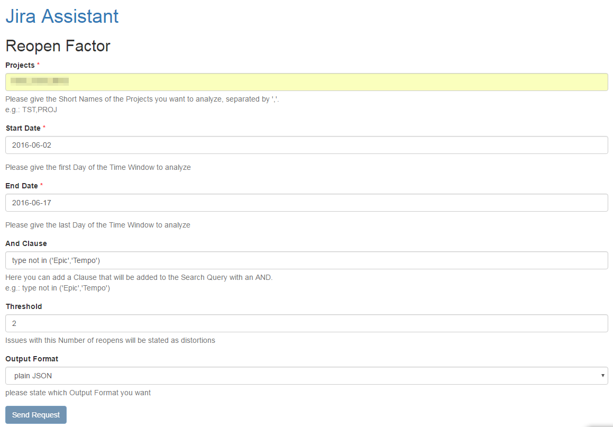

=====
Input
=====

Fields
======

Projects
--------

Here you can define which projects you want to analyse.

Start date
----------

The start of the time frame you want to analyse.

End date
--------

The end of the time frame you want to analyse.

AND clause
----------

Here you can add an AND clause to your analysis. This means it will be added to
the JQL query, so it has to be valid JQL (JIRA Query Language) the clause will
be added with an AND you must not enter the AND.

Threshold
---------

The threshold defines which issues will be separately tracked. If the number of
reopens is equal or greater than the threshold it will be listed (see below).

Output format
-------------

Here you can state the format you want the analysis result. Options are:

**Plain JSON**
  JSON will be rendered directly into the browser window, plugins like JSONView
  are recommended

**JSON file**
  You will get a download dialog to save the formatted JSON output to your
  harddrive
