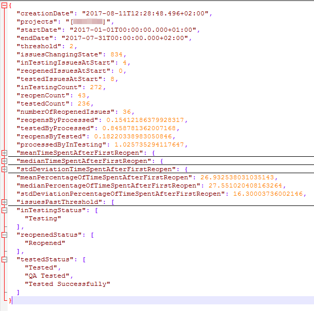

=======
Results
=======

Values
======

**creationDate**
  The date this analysis was calculated

**project**
  The project that was analysed

**startDate**
  The start of the time frame that was analysed

**endDate**
  The end of the time frame that was analysed

**andClause**
  The AND clause that was used in the filter of the analysis

**threshold**
  The threshold that was defined to track issues separately.

**issuesChangingState**
  Number of issues that changed in status in the given project during the given
  time frame

**inTestingIssuesAtStart**
  Number of issues that were in testing at the start of the time frame

**reopenedIssuesAtStart**
  Number of issues that were reopened at the start of the time frame

**testedIssuesAtStart**
  Number of issues that were tested successfully at the start of the time frame

**inTestingCount**
  Number of issues that were set in testing during the time frame

**reopenCount**
  Number of issues that were reopened during the time frame. The first reopen
  is only counted after the issue was in testing once.

**testedCount**
  Number of issues that were tested successfully during the time frame

**reopensByProcessed**
  The percentage of issues that were reopened during this time frame.
  reopenCount/(reopenCount + testedCount)

**testedByProcessed**
  The percentage of issues that were tested successfully during this time
  frame. testedCount/(reopenCount + testedCount)

**reopensByTested**
  The ratio of reopened to successfully tested issues during this time frame.
  reopenCount/testedCount

**processedByInTesting**
  The ratio of processed issues to issues that were set to in testing.
  (reopenCount + testedCount)/inTestingCount

**meanTimeSpentAfterFirstReopen**
  The mean of the time spent after the first reopen. The first reopen is only
  counted after the issue was in testing once.

**medianTimeSpentAfterFirstReopen**
  The median of the time spent after the first reopen. The first reopen is only
  counted after the issue was in testing once.

**stdDeviationTimeSpentAfterFirstReopen**
  The standard deviation of the time spent after the first reopen. The first
  reopen is only counted after the issue was in testing once.

**meanPercentageOfTimeSpentAfterFirstReopen**
  The mean of the percentages of time that was spent after the first reopen
  compared to the whole spent time on the issue. The first reopen is only
  counted after the issue was in testing once.

**medianPercentageOfTimeSpentAfterFirstReopen**
  The median of the percentages of time that was spent after the first reopen
  compared to the whole spent time on the issue. The first reopen is only
  counted after the issue was in testing once.

**stdDeviationPercentageOfTimeSpentAfterFirstReopen**
  The standard deviation of the percentages of time that was spent after the
  first reopen compared to the whole spent time on the issue. The first reopen
  is only counted after the issue was in testing once.

Objects
=======

**issuesPastThreshold**
  This list contains the issues that were reopened as often or more often as
  the threshold and the reopen count of those issues during this time frame

**inTestingStatus**
  Status that were counted as "In Testing" (currently beeing tested)

**reopenedStatus**
  Status that were counted as "Reopened" (Tests were not successful)

**testedStatus**
  Status that were counted as "Tested" (tested and deliverable)
