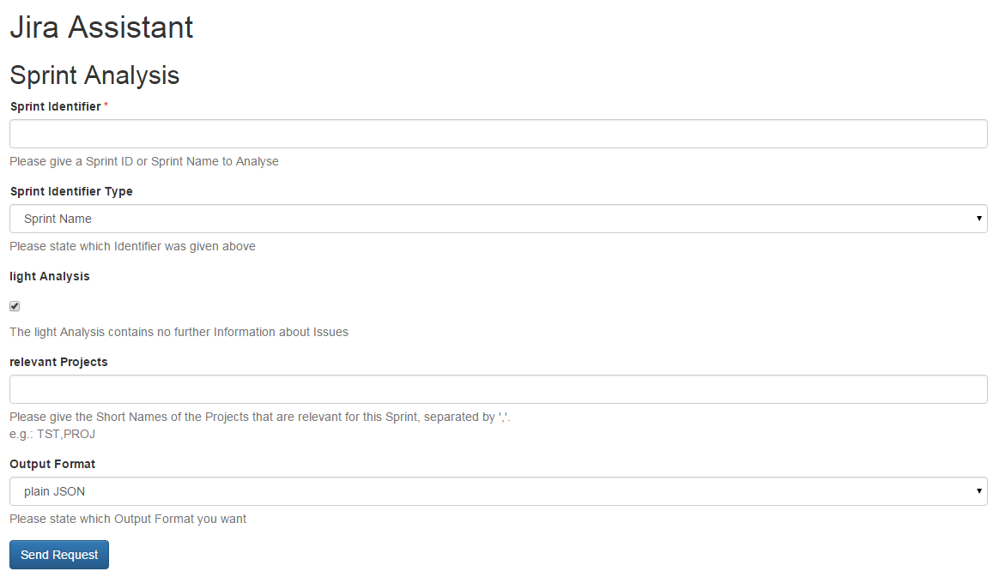

=====
Input
=====

Fields
======

Sprint identifier
-----------------

This field identifies the sprint, you can give the name or the ID of the sprint
you want to analyse.

Sprint identifier type
----------------------

In this dropdown you have to state which of the two possible identifiers you
stated in the previous field.

Light analysis
--------------

If you turn light analysis off, you get a lot of additional information about
the issues in the sprint. It is recommended to keep it turned on.

Relevant projects
-----------------

If there are projects in your team that were not represented in the sprint you
can state them here, so they will also be taken into account for the metrics
created defects / bugs.

If this field is empty only projects in the sprint will be used for the created
bugs / defects calculation.

Output format
-------------

Here you can state the format you want the analysis result. Options are:

**Plain JSON**
  JSON will be rendered directly into the browser window, plugins like JSONView
  are recommended.

**JSON file**
  You will get a download dialog to save the formatted JSON output to your
  harddrive.
