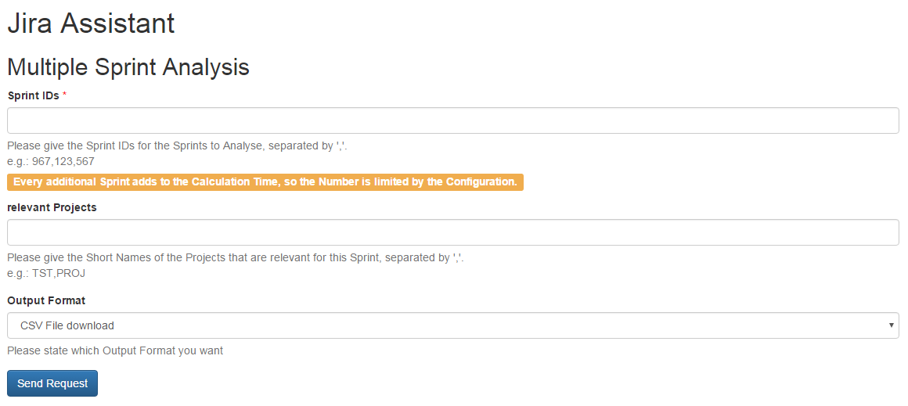
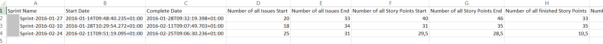

======================================
Multiple Sprint Analysis Documentation
======================================

.. warning::
  This Functionality uses the Sprint Analysis several times. This means:

  * Its not very fast, to not break JIRA in the Process
  * The number of Sprints you can analyse is limited by Configuration (currently to 6)
  * It is very vulnerable to Timeouts from JIRA

Input
=====

Fields
------

Sprint IDs
^^^^^^^^^^

Here you can state the Sprint IDs of the Sprints you want analysed. Only IDs are possible here.

relevant Projects
^^^^^^^^^^^^^^^^^

If there were Projects in your Team that were not represented in the Sprints you can state them here, so they will also be taken into Account for the Metrics created Defects / Bugs.

If this Field is empty only Projects in the Sprint will be used for the created Bugs / Defects Calculation.

Output Formats
^^^^^^^^^^^^^^

Here you can state the Format you want the Analysis Result. For this Functionality only CSV is available, since its use is to sum up Sprint Results in CSV.

Results
=======

The Results are Titled similar to the Results of the `Sprint Analysis <results.html>`_. The CSV doesn't contain all the Data from Sprint Analysis, since some of them are not easy to display in CSV Fromat (e.g.: the Lists with Issue Keys).

