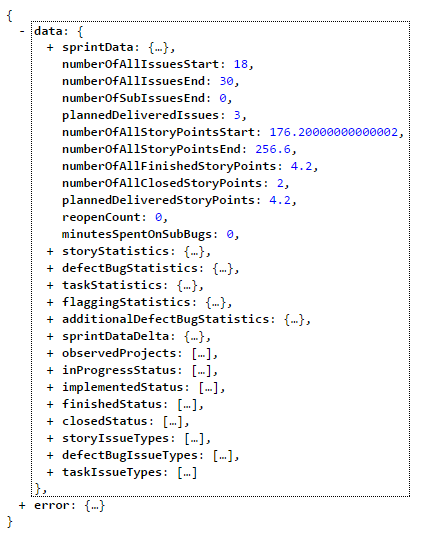
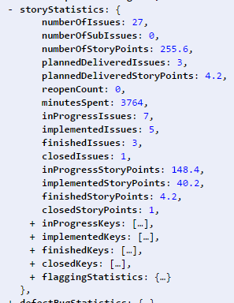
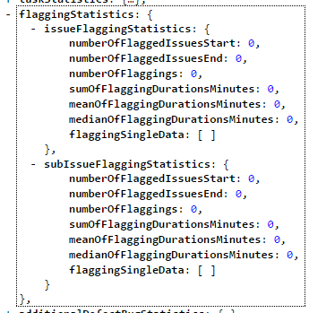
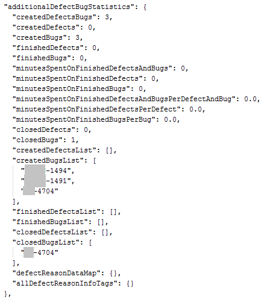
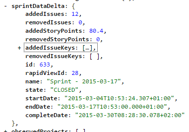

=======
Results
=======

Structure and Base Data
=======================

Values
------

**numberOfAllIssuesStart**
  Number of issues that were in the sprint at the start date/time

**numberOfAllIssuesEnd**
  Number of issues that were in the sprint at the completion date/time

**numberOfSubIssuesEnd**
  Number of sub issues that were in the sprint at the completion date/time

**plannedDeliveredIssues**
  Number of issues that were planned (in the sprint from the start) for this
  sprint and deliverable during this sprint

**numberOfAllStoryPointsStart**
  Number of story points that were in the sprint at the start date/time

**numberOfAllStoryPointsEnd**
  Number of story points that were in the sprint at the completion date/time

**numberOfAllFinishedStoryPoints**
  Number of story points that were finished (deliverable) at the completion
  date/time of the sprint. **This is the velocity of the team during this
  sprint**

**numberOfAllClosedStoryPoints**
  Number of story points that were closed or rejected (for stories this means
  not deliverable) at the completion date/time of the sprint.

**plannedDeliveredStoryPoints**
  Number of story points that were planned (in the sprint from the start) for
  this sprint and delivered during this sprint

**reopenCount**
  Number of reopen actions during this sprint. One issue that is reopened twice
  will count as two reopens

**minutesSpentOnSubBugs**
  Minutes booked on sub bug issues (fixing reopend issues)

Objects
-------

**sprintData**
  Base data about the sprint (e.g.: start, end, status, ...) for details see
  below with sprintDataDelta_

**storyStatistics**
  Statistics about stories handled during this sprint

**defectBugStatistics**
  Statistics about defects and bugs handled during this sprint (same structure
  as storyStatistics)

**taskStatistics**
  Statistics about tasks (all issue types that are neither stories nor defects
  or bugs) handled during this sprint (same structure as storyStatistics)

**flaggingStatistics**
  Statistics about flagged Issues during this Sprint

**additionalDefectBugStatistics**
  additional infromation and statistics about defects and bugs during this
  sprint

**sprintDataDelta**
  Information about changes during this sprint (issues added or removed)

**observedProjects**
  Projects that were taken into account for the additionalDefectBugStatistics

**inProgressStatus**
  Status that were counted as "In Progress" (still beeing worked on)

**implementedStatus**
  Status that were counted as "Implemented" (coded but untested)

**finishedStatus**
  Status that were counted as "Finished" (tested and deliverable)

**closedStatus**
  Status that were counted as "Closed" (closed or rejected, for stories this
  means not deliverable)

**storyIssueTypes**
  Issue types that were counted as stories

**defectBugIssueTypes**
  Issue types that were counted as defects and bugs

**taskIssueTypes**
  Issue types that were counted as tasks (all issue types that are neither
  stories nor defects or bugs)

storyStatistics
===============

.. _storyStatistics:

Values
------

**numberOfIssues**
  Number of stories handled during this sprint

**numberOfSubIssues**
  Number of sub-issues handled during this sprint

**numberOfStoryPoints**
  Number of story points for stories handled during this sprint

**plannedDeliveredIssues**
  Number of stories that were planned (in the sprint from the start) for this
  sprint and deliverable during this sprint

**plannedDeliveredStoryPoints**
  Number of story points for stories that were planned (in the sprint from the
  start) for this sprint and deliverable during this sprint

**reopenCount**
  Number of reopen actions for stories during this sprint. One issue that is
  reopened twice will count as two reopens

**minutesSpent**
  Minutes booked on stories during this sprint

**inProgressIssues**
  Number of stories that were in progress at the end of the sprint (still
  beeing worked on)

**implementedIssues**
  Number of stories that were implemented at the end of the sprint (coded but
  untested)

**finishedIssues**
  Number of stories that were finished at the end of the sprint (tested and
  deliverable)

**closedIssues**
  Number of stories that were closed at the end of the sprint (for stories this
  means not deliverable)

**inProgressStoryPoints**
  Number of story points for stories that were in progress at the end of the
  sprint (still beeing worked on)

**implementedStoryPoints**
  Number of story points for stories that were implemented at the end of the
  sprint (coded but untested)

**finishedStoryPoints**
  Number of story points for stories that were finished at the end of the
  sprint (tested and deliverable)

**closedStoryPoints**
  Number of story points for stories that were closed at the end of the sprint
  (for stories this means not deliverable)

Objects
-------

**inProgressKeys**
  Keys of issue that were in progress at the end of the sprint (see
  inProgressStatus for the statusnames)

**implementedKeys**
  Keys of issue that were implemented at the end of the sprint (see
  implementedStatus for the statusnames)

**finishedKeys**
  Keys of issue that were in finished at the end of the sprint (see
  finishedStatus for the statusnames)

**closedKeys**
  Keys of issue that were in closed at the end of the sprint (see closedStatus
  for the statusnames)

**flaggingStatistics**
  Statistics about flagged issues during this sprint (see the detailed
  explaination for this object below)

defectBugStatistics
===================

The same as storyStatistics_, just for defects and bugs

taskStatistics
==============

The same as storyStatistics_, just for issues that are neither stories nor bugs or defects

flaggingStatistics
==================

The flagging statistics has two parts with the same values, one for issues the
other for the sub issues

Values
------

**numberOfFlaggedIssuesStart**
  Number of issues that were flagged when the sprint started

**numberOfFlaggedIssuesEnd**
  Number of issues that were flagged when the sprint ended

**numberOfFlaggings**
  Number of flagging actions during the sprint. One issue that is flagged twice
  will count as two flaggings

**sumOfFlaggingDurationsMinutes**
  Total minutes issues were flagged during this sprint

**meanOfFlaggingDurationsMinutes**
  Mean of the minutes issues were flagged during this sprint

**medianOfFlaggingDurationsMinutes**
  Median of the minutes issues were flagged during this sprint

**flaggingSingleData**
  Detailed information about the flagged issues

additionalDefectBugStatistics
=============================

Values
------

**createdDefectsBugs**
  Number of bugs and defects created during the sprint in the observed projects
  (see under structure and base data)

**createdDefects**
  Number of defects created during the sprint in the observed projects (see
  under structure and base data)

**createdBugs**
  Number of bugs created during the sprint in the observed projects (see under
  structure and base data)

**finishedDefects**
  Number of defects that were fixed during the sprint in the observed projects
  (see under structure and base data)

**finishedBugs**
  Number of bugs that were fixed during the sprint in the observed projects
  (see under structure and base data)

**minutesSpentOnFinishedDefectsAndBugs**
  The total time booked on all bugs and defects that were finished during this
  sprint in the observed projects (see under structure and base data)

**minutesSpentOnFinishedDefects**
  The total time booked on all defects that were finished during this sprint in
  the observed projects (see under structure and base data)

**minutesSpentOnFinishedBugs**
  The total time booked on all bugs that were finished during this sprint in
  the observed projects (see under structure and base data)

**minutesSpentOnFinishedDefectsAndBugsPerDefectAndBug**
  The total time booked on all bugs and defects that were finished during this
  sprint per issue in the observed projects (see under structure and base data)

**minutesSpentOnFinishedDefectsPerDefect**
  The total time booked on all defects that were finished during this sprint
  per issue in the observed projects (see under structure and base data)

**minutesSpentOnFinishedBugsPerBug**
  The total time booked on all bugs that were finished during this sprint per
  issue in the observed projects (see under structure and base data)

**closedDefects**
  Number of defects that were closed or rejected during the sprint in the
  observed projects (see under structure and base data)

**closedBugs**
  Number of defects that were closed or rejected during the sprint in the
  observed projects (see under structure and base data)

**createdDefectsList**
  List of keys for the defects created during the sprint in the observed
  projects

**createdBugsList**
  List of keys for the bugs created during the sprint in the observed projects

**finishedDefectsList**
  List of keys for the defects fixed during the sprint in the observed projects

**finishedBugsList**
  List of keys for the bugs fixed during the sprint in the observed projects

**closedDefectsList**
  List of keys for the defects closed or rejected during the sprint in the
  observed projects

**closedBugsList**
  List of keys for the bugs closed or rejected during the sprint in the
  observed projects

Objects
-------

**defectReasonDataMap**
  Map of data with defect reasons during this sprint

  *reasonMinutesSpentAliquot*
    The time booked on issues with this defect reason split up on all given
    defect reasons for the issue. If there are three reasons on the issue the
    booked time is split up to the three reasons.
  *reasonMinutesSpentFull*
    The full time booked on issues with this defect reason. If there are three
    reasons on the issue the booked time is counted full for all three reasons.

**allDefectReasonInfoTags**
  Tags given additional to the defect reasons and their count

sprintDataDelta
===============

.. _sprintDataDelta:

Values
------

**addedIssues**
  Number of issues added to the sprint

**removedIssues**
  Number of issues removed from the sprint

**addedStoryPoints**
  Number of story points added to the sprint

**removedStoryPoints**
  Number of story points removed from the sprint

**addedIssueKeys**
  Keys of the issues added to the sprint

**removedIssueKeys**
  Keys of the issues removed from the sprint

Sprint Base Data
----------------

**id**
  Sprint ID

**rapidViewId**
  ID of the rapid board (sprint board)

**name**
  Name of the sprint

**state**
  State the sprint was in at the time of the analysis

**startDate**
  start date of the sprint (manually entered)

**endDate**
  end date of the sprint (manually entered)

**completeDate**
  date the sprint was closed in JIRA (automatically generated)
