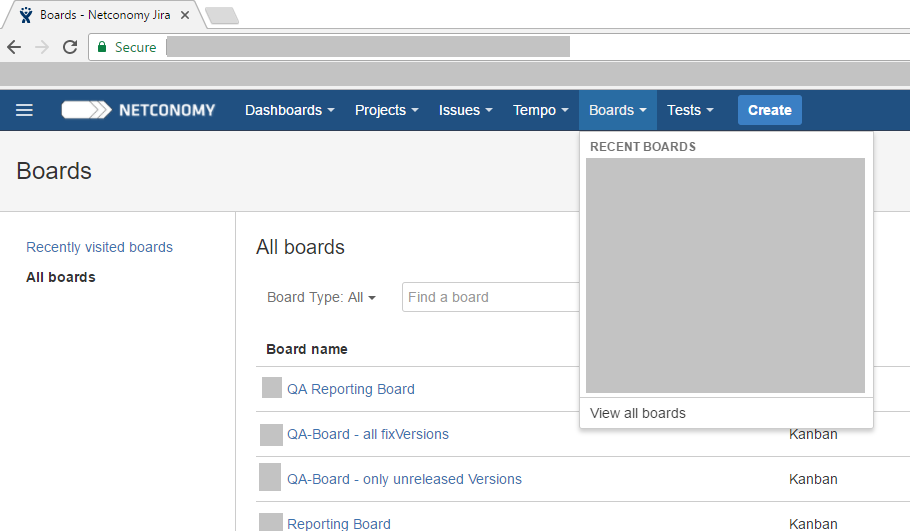
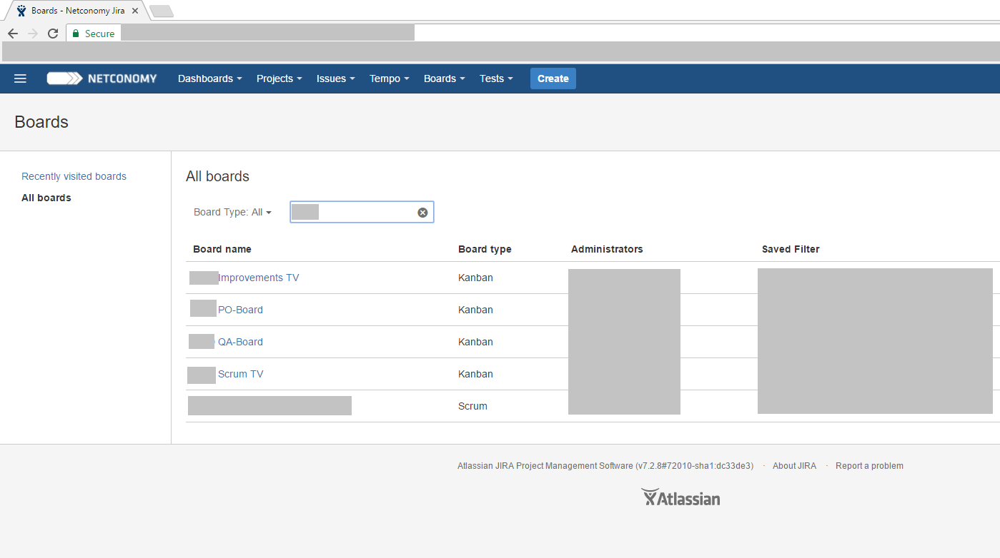
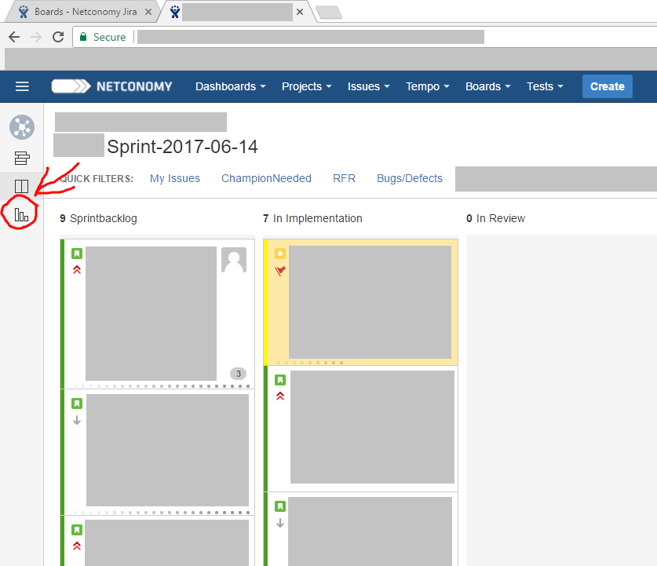
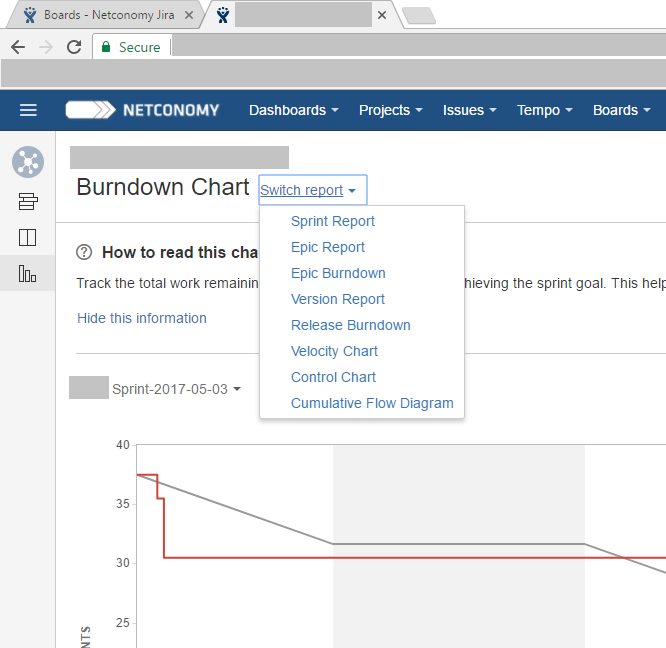
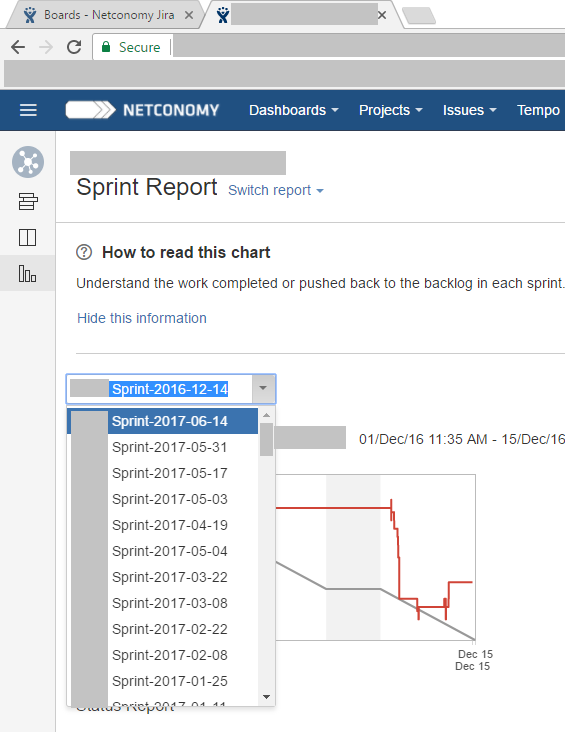
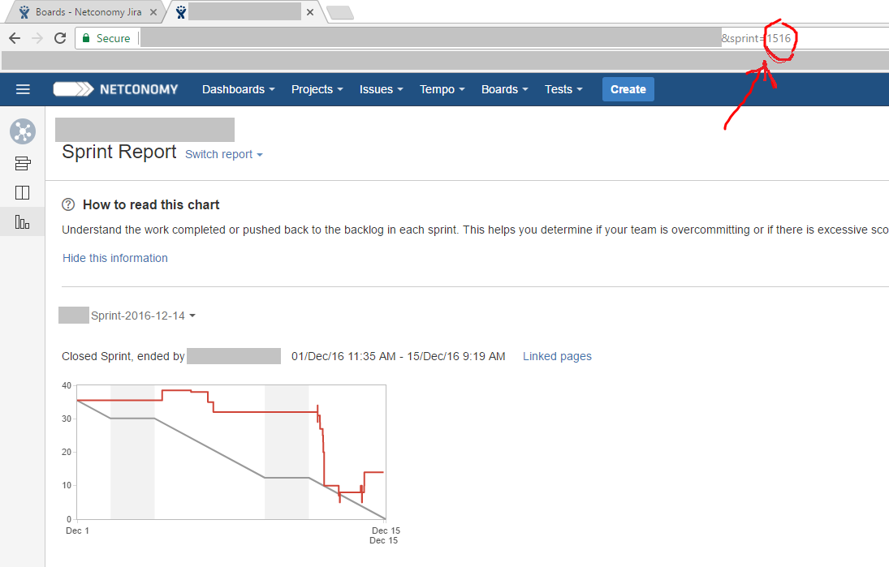

.. _sprintid:

=======================
How to find a Sprint ID
=======================

This describes how you can find out what ID a specific Sprint has, in Case you need it for Analysis or Search Queries.

1. Open the according Scrum Board in Jira
=========================================

1.1 recently opened Boards
--------------------------

If you recently opened the Board you will find it under the first Boards listed when you open the Boards Menu in the Header.

1.2 Boards you never opened or didn't open recently
---------------------------------------------------

If you don't see the Board you want in the List under Boards Menu, you have to look the Board up. Just open "View all Boards" in the Boards Menu (last Option) and search for the Board by Name.

2. Open the Sprint Report
=========================

2.1 Open the Report Section of the Scrum Board
----------------------------------------------

On the left side of the Board you can find the Tabs of the Board. The Reports Section is marked by 3 Bars getting smaller from left to right.

2.2 Switch to the Sprint Report
-------------------------------

Next to the name of the current Report click the Link "Switch Report" and choose the Sprint Report.

2.3 Open the Sprint you are looking for
---------------------------------------

By default one of the finished Sprints of this Board will be shown. If it already is the Sprint you want skip ahead to Step 2.4.

If you don't see the Sprint you are looking for right away. Open the Sprints Drop Down and choose the Sprint you want.

2.4 Read the Sprint ID from the Addressfield
--------------------------------------------

After the correct Sprint is chosen you just have to look to the addressfield in your browser to see the ID of the chosen Sprint.

