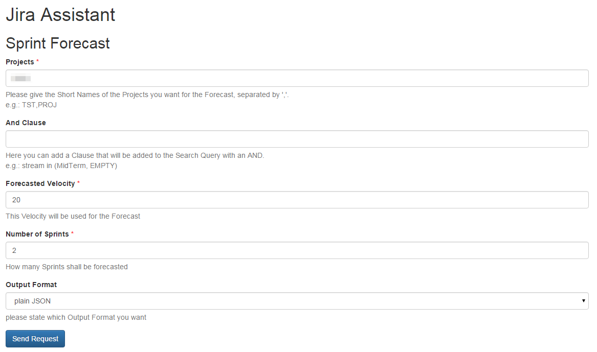

=====
Input
=====

Fields
======

Projects
--------

Here you define the backlog that will be taken into account for the forecast.
If you want to use multiple projects just seperate them with colons "," no
spaces.

AND clause
----------

Here you can add an AND clause to your backlog definition. This means it will
be added to the JQL query, so it has to be valid JQL (JIRA Query Language) the
clause will be added with an AND you must not enter the AND.

Forecasted velocity
-------------------

Here you can specify which velocity shell be used for the forecast.

Number of sprints
-----------------

How many sprints shell be forecasted

Output format
-------------

Here you can state the format you want the forecast result. Options are:

**Plain JSON**
  JSON will be rendered directly into the browser window, plugins like JSONView
  are recommended

**CSV file download**
  You will get a download dialog to save a CSV with the forecast to your
  harddrive
