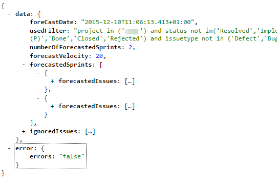
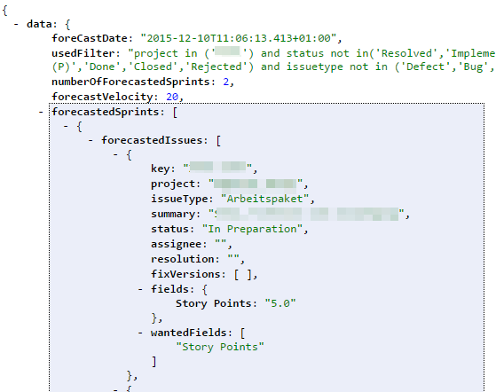

=======
Results
=======

Values
------

**foreCastDate**
  The date and time when the forecast was created

**usedFilter**
  The JQL filter that was used as backlog for this forecast

**numberOfForecastedSprints**
  The number of sprints that was forecast

**forecastVelocity**
  The velocity that was used for this forecast

Objects
-------

**forecastedSprints**
  The sprints of this forecast. In this case two.

**ignoredIssues**
  The issues that were ignored for this forecast, because they had no
  estimation or the estimation was 0.

The issues in the forcast as shown above only contain some data of the issue.
