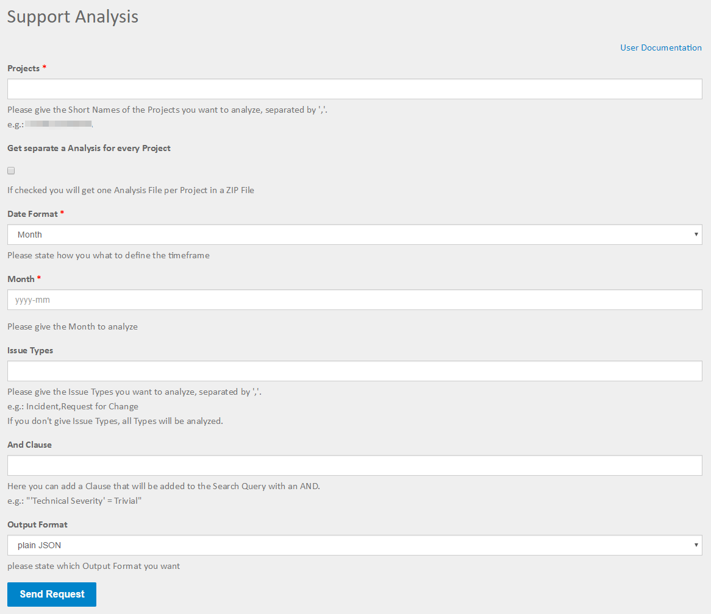
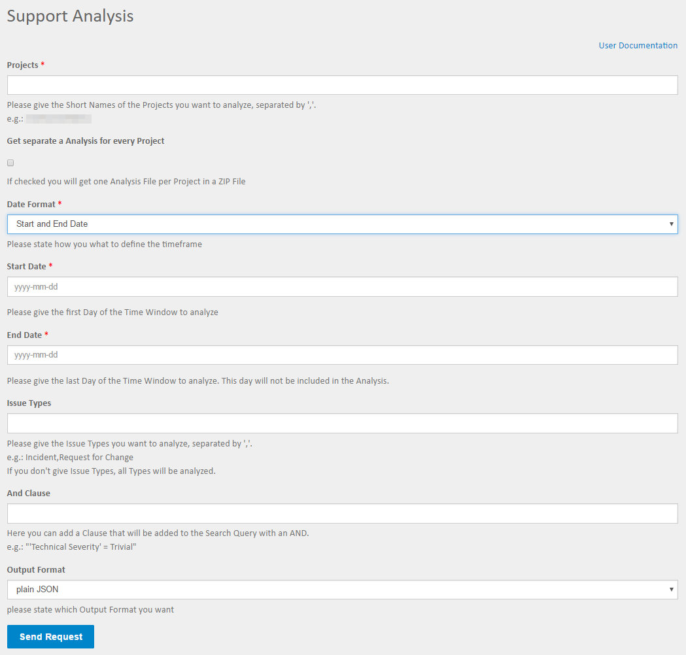

=====
Input
=====

Fields
======

Projects
--------

Here you can define which projects you want to analyse. If you want to analyse
multiple projects just separate them with colons "," no spaces.

Get a separate Analysis for every project
-----------------------------------------

If you check this checkbox you will get one support analysis report for every
single project given above packed into a ZIP file.

.. warning::
  If you try to get a lot of separate reports the runtime will go up, this
  might lead to a timeout.

Date format
-----------

You can choose between analyzing a month or a custom time-frame.

Month
-----

*This field is only shown if you choose "Month" as date format*
You can state the month you want to analyze.

Start date
----------

*This field is only shown if you choose "Start and end date" as date format*
The start date of the time-frame to analyze.

End date
--------

*This field is only shown if you choose "Start and end date" as date format*
The end date of the time-frame to analyze.

Issue types
-----------

The issue types you want to analyse. If you want to analyze multiple issue
types just separate them with colons "," no spaces.

AND clause
----------

Here you can add an AND clause to your analysis. This means it will be added to
the JQL query, so it has to be valid JQL (JIRA Query Language) the clause will
be added with an AND you must not enter the AND.

Output format
-------------

Here you can state the format you want the analysis result. Options are:

**Plain JSON**
  JSON will be rendered directly into the browser window, plugins like JSONView
  are recommended.

**JSON file**
  You will get a download dialog to save the formatted JSON output to your
  harddrive.
