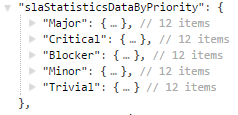

=======
Results
=======

Structure and Base Data
=======================

Values
------

**analysisDate**
  The Date and Time this Analysis was exectued

**projects**
  A List of the analysed Projects

**startDate**
  The Start of the analysed time-frame

**endDate**
  The End of the analysed time-frame

**issueTypes**
  A List of the analysed Issue Types, if there were Issue Types restricted

**numberOfAnalysedIssues**
  The Number of Issues who were analysed. Issues that were changed during the time-frame and fit the Search Criteria (Issue Type and andClause).

**createdIssuesInTimeFrame**
  The Number of Issues which were created during the time-frame and fitted the Search Criteria (Issue Type and andClause).

**createdIssuesThisYear**
  The Number of Issues which were created from the start of the Year till the end of the time-frame and fitted the Search Criteria (Issue Type and andClause).

**solvedIssuesDuringTimeFrame**
  The Number of Issues which were solved during the time-frame and fitted the Search Criteria (Issue Type and andClause). Solved meaning been set to a Status defined as solved, see solvedStatus in Objects.

**solvedIssuesThisYear**
  The Number of Issues which were solved from the start of the Year till the end of the time-frame and fitted the Search Criteria (Issue Type and andClause). Solved meaning been set to a Status defined as solved, see solvedStatus in Objects.

**numberOfBillableIssuesInTimeFrame**
  The Number of Issues that were billable during the time-frame and fitted the Search Criteria (Issue Type and andClause). An Issue is billable if the BillableSupportField (defined in the Configuration) is not null, empty or 0.

**numberOfUnbillableIssuesInTimeFrame**
  The Number of Issues that were unbillable during the time-frame and fitted the Search Criteria (Issue Type and andClause). An Issue is unbillable if the BillableSupportField (defined in the Configuration) is 0.

**meanTimeSpentDuringTimeFrame**
  The mean of the Time spent on Issues during this time-frame and fitting the Search Criteria (Issue Type and andClause). If there was time spent on those issues outside the time-frame it is not counted here, for that see meanTimeSpentOnIssues.

**medianTimeSpentDuringTimeFrame**
  The median of the Time spent on Issues during this time-frame and fitting the Search Criteria (Issue Type and andClause). If there was time spent on those issues outside the time-frame it is not counted here, for that see medianTimeSpentOnIssues.

**standardDeviationTimeSpentDuringTimeFrame**
  The standardDeviation of the Time spent on Issues during this time-frame and fitting the Search Criteria (Issue Type and andClause). If there was time spent on those issues outside the time-frame it is not counted here, for that see standardDeviationTimeSpentOnIssues.

**timeSpentDuringTimeFrame90thPercentile**
  The 90th Percentile of the Time spent on Issues during this time-frame and fitting the Search Criteria (Issue Type and andClause). If there was time spent on those issues outside the time-frame it is not counted here, for that see timeSpentOnIssues90thPercentile.

**timeSpentDuringTimeFrame99thPercentile**
  The 99th Percentile of the Time spent on Issues during this time-frame and fitting the Search Criteria (Issue Type and andClause). If there was time spent on those issues outside the time-frame it is not counted here, for that see timeSpentOnIssues99thPercentile.

**meanTimeSpentOnIssues**
  The mean of all Time spent on Issues changed during this time-frame and fitting the Search Criteria (Issue Type and andClause). All the Time is taken into account even if it was outside the time-frame.

**medianTimeSpentOnIssues**
  The median of all Time spent on Issues changed during this time-frame and fitting the Search Criteria (Issue Type and andClause). All the Time is taken into account even if it was outside the time-frame.

**standardDeviationTimeSpentOnIssues**
  The standardDeviation of all Time spent on Issues changed during this time-frame and fitting the Search Criteria (Issue Type and andClause). All the Time is taken into account even if it was outside the time-frame.

**timeSpentOnIssues90thPercentile**
  The 90th Percentile of all Time spent on Issues changed during this time-frame and fitting the Search Criteria (Issue Type and andClause). All the Time is taken into account even if it was outside the time-frame.

**timeSpentOnIssues99thPercentile**
  The 99th Percentile of all Time spent on Issues changed during this time-frame and fitting the Search Criteria (Issue Type and andClause). All the Time is taken into account even if it was outside the time-frame.

**numberOfOpenIssuesStartDate**
  The Number of Issues that were in an open Status at the start of the time-frame and fitted the Search Criteria (Issue Type and andClause). Open Status are defined by the Configuration, see openStatus in Objects.

**meanAgeOfOpenIssuesStartDate**
  The mean Age (time since they were created) of Issues that were in an open Status at the start of the time-frame and fitted the Search Criteria (Issue Type and andClause). Open Status are defined by the Configuration, see openStatus in Objects.

**medianAgeOfOpenIssuesStartDate**
  The median Age (time since they were created) of Issues that were in an open Status at the start of the time-frame and fitted the Search Criteria (Issue Type and andClause). Open Status are defined by the Configuration, see openStatus in Objects.

**standardDeviationAgeOfOpenIssuesStartDate**
  The standardDeviation Age (time since they were created) of Issues that were in an open Status at the start of the time-frame and fitted the Search Criteria (Issue Type and andClause). Open Status are defined by the Configuration, see openStatus in Objects.

**ageOfOpenIssuesStartDate90thPercentile**
  The 90th Percentile of the Age (time since they were created) of Issues that were in an open Status at the start of the time-frame and fitted the Search Criteria (Issue Type and andClause). Open Status are defined by the Configuration, see openStatus in Objects.

**ageOfOpenIssuesStartDate99thPercentile**
  The 99th Percentile of the Age (time since they were created) of Issues that were in an open Status at the start of the time-frame and fitted the Search Criteria (Issue Type and andClause). Open Status are defined by the Configuration, see openStatus in Objects.

**numberOfOpenIssuesEndDate**
  The Number of Issues that were in an open Status at the end of the time-frame and fitted the Search Criteria (Issue Type and andClause). Open Status are defined by the Configuration, see openStatus in Objects.

**meanAgeOfOpenIssuesEndDate**
  The mean Age (time since they were created) of Issues that were in an open Status at the end of the time-frame and fitted the Search Criteria (Issue Type and andClause). Open Status are defined by the Configuration, see openStatus in Objects.

**medianAgeOfOpenIssuesEndDate**
  The median Age (time since they were created) of Issues that were in an open Status at the end of the time-frame and fitted the Search Criteria (Issue Type and andClause). Open Status are defined by the Configuration, see openStatus in Objects.

**standardDeviationAgeOfOpenIssuesEndDate**
  The standardDeviation Age (time since they were created) of Issues that were in an open Status at the end of the time-frame and fitted the Search Criteria (Issue Type and andClause). Open Status are defined by the Configuration, see openStatus in Objects.

**ageOfOpenIssuesEndDate90thPercentile**
  The 90th Percentile of the Age (time since they were created) of Issues that were in an open Status at the end of the time-frame and fitted the Search Criteria (Issue Type and andClause). Open Status are defined by the Configuration, see openStatus in Objects.

**ageOfOpenIssuesEndDate99thPercentile**
  The 99th Percentile of the Age (time since they were created) of Issues that were in an open Status at the end of the time-frame and fitted the Search Criteria (Issue Type and andClause). Open Status are defined by the Configuration, see openStatus in Objects.

Objects
-------

**slaStatisticsData**
  Special SLA Statistics Data about the analysed Issues, for Details see below at slaStatisticsData_

**slaStatisticsDataByPriority**
  Special SLA Statistics Data about the analysed Issues separated by the Priority of the Issues, for Details see below at slaStatisticsDataByPrio_

**createdIssuesInTimeFrameByPriority**
  The Number of Issues which were created during the time-frame and fitted the Search Criteria (Issue Type and andClause) by the Priority of the Issues.

**createdIssuesThisYearByPriority**
  The Number of Issues which were created from the start of the Year till the end of the time-frame and fitted the Search Criteria (Issue Type and andClause) by the Priority of the Issues.

**solvedIssuesDuringTimeFrameByPriority**
  The Number of Issues which were solved during the time-frame and fitted the Search Criteria (Issue Type and andClause) by the Priority of the Issues. Solved meaning been set to a Status defined as solved, see solvedStatus in Objects.

**solvedIssuesThisYearByPriority**
  The Number of Issues which were solved from the start of the Year till the end of the time-frame and fitted the Search Criteria (Issue Type and andClause) by the Priority of the Issues. Solved meaning been set to a Status defined as solved, see solvedStatus in Objects.

**errorCategoryData**
  Special Data about Error Categories in the analysed Issues, for Details see below at errorCategoryData_

**technicalSeverityData**
  Special Data about the technical Severity in the analysed Issues, for Details see below at technicalSeverityData_

**openStatus**
  Status that were counted as open, defined through the Configuration on the Server.

**solvedStatus**
  Status that were counted as solved, defined through the Configuration on the Server.

.. _fallbacks:

**reactionTimeEndStatus**
  Status that signal the end of the Reaction Time, defined through the Configuration on the Server. A Fallback for the case the Reaction Time is not defined as an SLA in the Jira Service Desk Plugin (GTR).

**interactionTimeStartStatus**
  Status that signal the start of the Interaction Time, defined through the Configuration on the Server. A Fallback for the case the Interaction Time is not defined as an SLA in the Jira Service Desk Plugin (GTI).

**interactionTimeEndStatus**
  Status that signal the end of the Interaction Time, defined through the Configuration on the Server. A Fallback for the case the Interaction Time is not defined as an SLA in the Jira Service Desk Plugin (GTI).

**solutionTimeStartStatus**
  Status that signal the start of the Solution Time, defined through the Configuration on the Server. A Fallback for the case the Solution Time is not defined as an SLA in the Jira Service Desk Plugin (GTS).

**solutionTimeEndStatus**
  Status that signal the end of the Solution Time, defined through the Configuration on the Server. A Fallback for the case the Solution Time is not defined as an SLA in the Jira Service Desk Plugin (GTS).

.. _slaStatisticsData:

Sla Statistics Data
===================

**numberOfIssues**
  The number of Issues that were analysed for the Sla Data.

**numberOfBrokenSLAs**
  The number of times an SLA Cycle was broken (SLA Cycles are defined in Jira Service Desk). If a Cycle is restarted the same Cycle 'Type' can be broken more than one time for the same Issue.

**numberOfKeptSLAs**
  The number of times an SLA Cycle was finished in time.

**meanReactionTimeInTimeFrame**
  The mean of all Reaction Time Instances/Cycles during the Timeframe. There is a Fallback in case the Reaction Time is not defined as an SLA in the Jira Service Desk Plugin (GTR). see fallbacks_

**medianReactionTimeInTimeFrame**
  The median of all Reaction Time Instances/Cycles during the Timeframe. There is a Fallback in case the Reaction Time is not defined as an SLA in the Jira Service Desk Plugin (GTR). see fallbacks_

**standardDeviationReactionTimeInTimeFrame**
  The standardDeviation of all Reaction Time Instances/Cycles during the Timeframe. There is a Fallback in case the Reaction Time is not defined as an SLA in the Jira Service Desk Plugin (GTR). see fallbacks_

**reactionTimeInTimeFrame90thPercentile**
  The 90th Percentile of all Reaction Time Instances/Cycles during the Timeframe. There is a Fallback in case the Reaction Time is not defined as an SLA in the Jira Service Desk Plugin (GTR). see fallbacks_

**reactionTimeInTimeFrame99thPercentile**
  The 99th Percentile of all Reaction Time Instances/Cycles during the Timeframe. There is a Fallback in case the Reaction Time is not defined as an SLA in the Jira Service Desk Plugin (GTR). see fallbacks_

**meanInteractionTimeInTimeFrame**
  The mean of all Interaction Time Instances/Cycles during the Timeframe. There is a Fallback in case the Interaction Time is not defined as an SLA in the Jira Service Desk Plugin (GTI). see fallbacks_

**medianInteractionTimeInTimeFrame**
  The median of all Interaction Time Instances/Cycles during the Timeframe. There is a Fallback in case the Interaction Time is not defined as an SLA in the Jira Service Desk Plugin (GTI). see fallbacks_

**standardDeviationInteractionTimeInTimeFrame**
  The standardDeviation of all Interaction Time Instances/Cycles during the Timeframe. There is a Fallback in case the Interaction Time is not defined as an SLA in the Jira Service Desk Plugin (GTI). see fallbacks_

**interactionTimeInTimeFrame90thPercentile**
  The 90th Percentile of all Interaction Time Instances/Cycles during the Timeframe. There is a Fallback in case the Interaction Time is not defined as an SLA in the Jira Service Desk Plugin (GTI). see fallbacks_

**interactionTimeInTimeFrame99thPercentile**
  The 99th Percentile of all Interaction Time Instances/Cycles during the Timeframe. There is a Fallback in case the Interaction Time is not defined as an SLA in the Jira Service Desk Plugin (GTI). see fallbacks_

**meanSolutionTime**
  The mean of all Solution Time Instances/Cycles during the Timeframe. There is a Fallback in case the Solution Time is not defined as an SLA in the Jira Service Desk Plugin (GTS). see fallbacks_

**medianSolutionTime**
  The median of all Solution Time Instances/Cycles during the Timeframe. There is a Fallback in case the Solution Time is not defined as an SLA in the Jira Service Desk Plugin (GTS). see fallbacks_

**standardDeviationSolutionTime**
  The standardDeviation of all Solution Time Instances/Cycles during the Timeframe. There is a Fallback in case the Solution Time is not defined as an SLA in the Jira Service Desk Plugin (GTS). see fallbacks_

**solutionTime90thPercentile**
  The 90th Percentile of all Solution Time Instances/Cycles during the Timeframe. There is a Fallback in case the Solution Time is not defined as an SLA in the Jira Service Desk Plugin (GTS). see fallbacks_

**solutionTime99thPercentile**
  The 99th Percentile of all Solution Time Instances/Cycles during the Timeframe. There is a Fallback in case the Solution Time is not defined as an SLA in the Jira Service Desk Plugin (GTS). see fallbacks_

**fallbackUsedForReactionTime**
  This indicates if the Fallback for the Reaction Time had to be used because the SLA wasn't defined in Jira. The Fallback is in absolute Time (24h per Day) instead of the SLAs who are only counted during Office hours (mostly 8am to 17pm). So FallBack Times will be higher.

**fallbackUsedForInteractionTime**
  This indicates if the Fallback for the Interaction Time had to be used because the SLA wasn't defined in Jira. The Fallback is in absolute Time (24h per Day) instead of the SLAs who are only counted during Office hours (mostly 8am to 17pm). So FallBack Times will be higher.

**fallbackUsedForSolutionTime**
  This indicates if the Fallback for the Solution Time had to be used because the SLA wasn't defined in Jira. The Fallback is in absolute Time (24h per Day) instead of the SLAs who are only counted during Office hours (mostly 8am to 17pm). So FallBack Times will be higher.

.. _slaStatisticsDataByPrio:

Sla Statistics Data by Priority
===============================

This Objects contains seperate Sla Statistics Objects based on the Priority of the Issues they were calculated from. For Details see above at slaStatisticsData_

.. _errorCategoryData:

Error Category Data
===================

This Map contains Information about all occuring Error Categories (Jira Field)

**categoryName**
  The Name of the Error Category.

**categoryCount**
  The number of times this Error Category occured.

**categoryMinutesSpentAliquot**
  The time spent on Issues with this Error Category. Aliquot means, if there was more than one Error Category on this Issue the Time spent was split up in equal Parts.

**categoryMinutesSpentFull**
  The time spent on Issues with this Error Category. Full means, if there was more than one Error Category on this Issue the Time spent was counted full for all occuring Error Categories.

.. _technicalSeverityData:

Technical Severity Data
=======================

This Map contains all occuring technical Severity Levels and the number of Times they occured.
